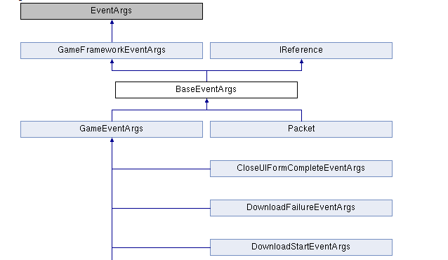

# GameFramework框架大纲

## UGF-Component层

### abstract GameFrameworkComponent:MonoBehaviour
1. GameFrameworkComponent是所有Component的抽象基类
2. `virtual Awake()`将自身注册到**静态工具类GameEntry**类的单链表中，GameEntry也提供了模块的获取方法
### BaseComponent:GameFrameworkComponent
1. **Awake()** 初始化各种Helper
2. **Update()** 调用GameFrameworkEntry.Update()，即一切轮询的开端
### static GameEntry工具类
1. `LinkedList<GameFrameworkComponent> s_GameFrameworkComponents` 组件单链表
2. `GetComponent()/GetComponent<T>()` 获取组件
3. `RegisterComponent(GameFrameworkComponent)` 注册游戏框架组件
4. `Shutdown(ShutdownType)` 关闭游戏框架

## GF--Manager层
### abstract GameFrameModule--管理器基类
1. `virtual Priority `游戏框架模块优先级，默认为0
2. `Update()` 游戏框架模块轮询
3. `Shutdown()` 关闭并清理游戏框架模块
### GameFrameworkEntry
1. `LinkedList<GameFrameworkModule> s_GameFrameworkModules` 游戏管理器模块单链表，按照优先级排序
2. `Update()` 控制所有管理器的轮询
3. `GetModule(Type)/GetModule<T>` 获取指定类型的游戏框架模块
4. `CreateModule(Type moduleType)` 创建游戏框架模块，并按照优先级保存到单链表中
```
GameFrameworkModule module = (GameFrameworkModule)Activator.CreateInstance(moduleType);
    if (module == null)
    {
        throw new GameFrameworkException(Utility.Text.Format("Can not create module '{0}'.", moduleType.FullName));
    }
    LinkedListNode<GameFrameworkModule> current = s_GameFrameworkModules.First;
    while (current != null)
    {
        if (module.Priority > current.Value.Priority)
        {
            break;
        }
        current = current.Next;
    }
    if (current != null)
    {
        s_GameFrameworkModules.AddBefore(current, module);
    }
    else
    {
        s_GameFrameworkModules.AddLast(module);
    }
    return module;
```
# Utility--框架工具类模块
*注意:工具类一般都是静态类，即成员都是静态成员*
## GF层
### Text--字符相关的实用函数
1. 变量
* `static StringBuilder s_CachedStringBuilder` 由[ThreadStatic]特性修饰的静态SB，长度为1024
2. 方法
* `Format(string format,params object[] args)` format:字符串格式 args:字符串参数
* `GetFullName<T>(string name)` 根据类型和名称获取完整名称 调用GetFullName(type,name)
* `GetFullName(Type type,string name)`
```
string typeName = type.FullName;
return string.IsNullOrEmpty(name) ? typeName : Format("{0}.{1}", typeName, name);
```
### Assembly--程序集相关的实用函数
1. 变量
* ` private static readonly System.Reflection.Assembly[] s_Assemblies` 存储已加载到此应用程序域的执行上下文的程序集数组
* `private static readonly Dictionary<string, Type> s_CachedTypes` 缓存所有已经被获取过的类型 key:fullName
2. 方法
* `Assembly[] GetAssemblies()` 获取已加载的程序集
* `Type[] GetTypes()/GetTypes(List<Type>)` 获取已加载程序集中的所有类型
* `Type GetType(string typeName)` 获取已加载程序集中的指定类型
```
Type type = null;
if (s_CachedTypes.TryGetValue(typeName, out type))
{
    return type;
}
type = Type.GetType(typeName);
if (type != null)
{
    s_CachedTypes.Add(typeName, type);
    return type;
}
foreach (System.Reflection.Assembly assembly in s_Assemblies)//如果直接根据类型名获取不到 则遍历已加载程序集 拼接成{类型FullName},{程序集.FullName}
{
    type = Type.GetType(Text.Format("{0}, {1}", typeName, assembly.FullName));
    if (type != null)
    {
        s_CachedTypes.Add(typeName, type);
        return type;
    }
}
return null;
```
### Path--路径相关的使用函数
* `string GetRegularPath(string path)` 获取规范的路径，即将传入的路径中的'\'都替换成'/'
* `string GetCombinePath(params string[] path)` 获取通过`Path.Combine()`连接后的路径，`Path.Combine()`是以`\`为分隔符，需要替换
* `GetRemotePath(params string[] path)` 获取远程格式的路径(带有file://或者http://前缀) 已经带有前缀则不拼接，不带则默认拼接"file:///"
* `string GetResourceNameWithSuffix(string resourceName)` 获取带后缀".dat"的资源名
* `string GetResourceNameWithCrc32AndSuffix(string resourceName,int hashCode)` 获取带有CRC32和后缀(.dat)的资源名,关键代码:`return Text.Format("{0}.{1:x8}.dat", resourceName, hashCode)`
* `bool RemoveEmptyDirectory(string directoryName)` 移除指定路径下的空文件夹
## UGF层
### static Helper--辅助器创建器相关的实用函数(辅助器都继承了MB)
* `public static T CreateHelper<T>(string helperTypeName, T customHelper, int index) where T : MonoBehaviour` 创建辅助器
```
T helper = null;
if (!string.IsNullOrEmpty(helperTypeName))//根据指定辅助器名 加载辅助器 并创建到场景物体中
{
    System.Type helperType = Utility.Assembly.GetType(helperTypeName);
    if (helperType == null)
    {
        Log.Warning("Can not find helper type '{0}'.", helperTypeName);
        return null;
    }
    if (!typeof(T).IsAssignableFrom(helperType))
    {
        Log.Warning("Type '{0}' is not assignable from '{1}'.", typeof(T).FullName, helperType.FullName);
        return null;
    }
    helper = (T)(new GameObject()).AddComponent(helperType);
}
else if (customHelper == null)//如果自定义辅助器为空 则返回空
{
    Log.Warning("You must set custom helper with '{0}' type first.", typeof(T).FullName);
    return null;
}
else if (customHelper.gameObject.InScene())//如果自定义辅助器在场景中
{
    helper = (index > 0 ? Object.Instantiate(customHelper) : customHelper);//如果指定的下标>0 则克隆原始物体
}
else
{
    helper = Object.Instantiate(customHelper);
}
return helper;
```
# GF/Base文件夹
## DataStruct
### enum LoadType 加载方式
`Text、Bytes、Stream`
## Log--日志模块
### enum GameFrameworkLogLevel 游戏框架的日志等级
`Debug,Info,Warning,Error,Fatal`
### GameFrameworkLog.ILogHelper 日志辅助器接口
`void Log(GameFrameworkLogLevel level, object message)` 记录日志
### static GameFrameworkLog 游戏框架日志类
1. 变量
* `static ILogHelper s_LogHelper` 日志辅助器
2. 方法
* `SetLogHelper(ILogHelper)` 设置日志辅助器
* `Debug()` 调试级别日志，**仅由Debug宏定义控制是否生效**，一般是gf底层层调用
* `Info()/Warning()/Error()/Fatal()`  仅仅被`Utility.Log`工具类调用，该工具类相应的调用方法受多种宏定义控制，如Warring级别:`ENABLE_LOG、ENABLE_WARNING_LOG、ENABLE_DEBUG_AND_ABOVE_LOG、ENABLE_INFO_AND_ABOVE_LOG、ENABLE_WARNING_AND_ABOVE_LOG、ENABLE_ERROR_AND_ABOVE_LOG`
## Task--任务模块
### ITask 任务接口
* `int SerialId` 获取任务的序列编号
* `Priority` 获取任务的优先级
* `bool Done` 获取任务是否完成
### ITaskAgent 任务代理接口
签名：`internal interface ITaskAgent<T> where T:IIask` T:任务类型
* `T Task` 获取任务
* `Initialize` 初始化任务代理
* `Update()` 任务代理轮询
* `Shutdown()` 关闭并清理任务代理
* `Start(T task)` 开始处理任务
* `Reset()` 停止正在处理的任务并重置任务代理
### TaskPool 任务池
1. 变量
* `readonly Stack<ITaskAgent<T>> m_FreeAgents` 空闲代理栈
* `LinkedList<ITaskAgent<T>> m_WorkingAgents` 工作中代理的单链表
* `LinkedList<T> m_WaitingTasks` 等待中任务单链表
* `int TotalAgentCount/FreeAgentCount/WorkingAgentCount/WaitingTaskCount`
2. 方法
* `Update()` 任务池轮询
```
LinkedListNode<ITaskAgent<T>> current = m_WorkingAgents.First;
while (current != null)
{
//遍历工作中代理单链表，判断是否完成 完成则从工作中代理转入空闲代理，没完成则执行任务代理轮询
    if (current.Value.Task.Done)
    {
        LinkedListNode<ITaskAgent<T>> next = current.Next;
        current.Value.Reset();
        m_FreeAgents.Push(current.Value);
        m_WorkingAgents.Remove(current);
        current = next;
        continue;
    }
    current.Value.Update(elapseSeconds, realElapseSeconds);
    current = current.Next;
}
//同时存在空闲代理以及等待中任务，将等待中的任务通过空闲代理放在执行代理链表中，并执行
while (FreeAgentCount > 0 && WaitingTaskCount > 0)
{
    ITaskAgent<T> agent = m_FreeAgents.Pop();
    LinkedListNode<ITaskAgent<T>> agentNode = m_WorkingAgents.AddLast(agent);
    T task = m_WaitingTasks.First.Value;
    m_WaitingTasks.RemoveFirst();
    agent.Start(task);
    if (task.Done)
    {
        agent.Reset();
        m_FreeAgents.Push(agent);
        m_WorkingAgents.Remove(agentNode);
    }
}
```
* `Shutdown()` 关闭并清理任务池  调用代理的Shutdown() 并清空上述3中集合
* `AddAgent(ITaskAgent<T> agent)` 增加任务代理
* `AddTask(T task)` 增加任务 按照任务的优先级插入到单链表中
* `RemoveTask(int serialId)` 移除任务 先遍历等待中任务，如果有则移除并返回，否则继续遍历工作中代理 判断工作中代理的任务的id是否符合，是则重置代理移入空闲代理中
* `RemoveAllTasks` 移除所有任务 清空工作中代理  将其中的代理都放入空闲代理中
# 框架模块详解
## FSM--状态机模块
### abstract FsmBase 有限状态机抽象基类
1. 成员变量
* `Name` 状态机名称
* `Type` 状态机持有者类型
* `FsmStateCount` 状态机中状态数量
* `IsRunning` 是否正在运行
* `IsDestroyed` 当前状态机是否被销毁
* `CurrentStateName` 当前状态的名称
* `CurrentStateTime` 当前状态持续时间
2. 成员方法
* `Update()` 有限状态机轮询
* `Shutdown()` 关闭并清理状态机
*注意：该抽象类所有成员皆为抽象类型*

### IFsm 有限状态机接口
签名：`interface IFsm<T> where T:class`
1. 成员变量
* `FsmState<T> currentState` 当前有限状态机的状态
* 其余同FsmBase，都会继承给Fsm状态机
2. 成员函数(分为泛型和非泛型两种)
* `Start<TState>() where TState : FsmState<T>/Start(Type stateType)` 以指定状态开始有限状态机
* `HasState<TState>() where TState : FsmState<T>/HasState(Type stateType)` 是否存在有限状态机状态
* `GetState<TState>() where TState : FsmState<T>/GetState(Type stateType)` 获取状态机中的指定状态
* `FireEvent()` 抛出有限状态机事件
* `GetAllStates()` 获取当前状态机的所有状态
* `GetData()/SetData()/HasData()/RemoveData()` 状态机数据的增删查
### FsmState 有限状态机状态基类
签名：`abstract class FsmState<T> where T : class`
1. 成员变量
* Dictionary<int, FsmEventHandler<T>> m_EventHandlers 当前状态对应的事件响应函数字典
2. 成员函数
* `virtual OnInit()` 状态初始化时调用
* `virtual OnEnter()` 状态进入时调用
* `virtual OnUpdate()` 状态轮询时调用
* `virtual OnDestroy()` 状态销毁时调用
* `SubscribeEvent(int eventId, FsmEventHandler<T> eventHandler)` 订阅状态机状态事件。eventId 事件编号，eventHandler 状态事件响应函数
* `UnsubscribeEvent()` 取消订阅有限状态机事件
* `ChangeState()` 切换当前有限状态机状态
* `OnEvent(IFsm<T> fsm, object sender, int eventId, object userData)` 执行指定id的事件响应函数
```
FsmEventHandler<T> eventHandlers = null;
if (m_EventHandlers.TryGetValue(eventId, out eventHandlers))
{
    if (eventHandlers != null)
    {
        eventHandlers(fsm, sender, userData);
    }
}
```
### Fsm 有限状态机
类签名：`internal sealed class Fsm<T> : FsmBase, IFsm<T> where T : class`
1. 成员变量
*  `Dictionary<string, FsmState<T>> m_States` 状态字典 当前状态机所有的状态
* `Dictionary<string, Variable> m_Datas` 数据字典 存储状态机所有状态之间传递的数据
* `T owner` 状态机持有者类型
* `FsmState<T> m_CurrentState` 当前状态机正在运行的状态
* 以及从状态机基类继承的属性
2. 成员函数
* `Fsm(string name, T owner, params FsmState<T>[] states)` 构造函数
```
if (owner == null)
{
    throw new GameFrameworkException("FSM owner is invalid.");
}
if (states == null || states.Length < 1)
{
    throw new GameFrameworkException("FSM states is invalid.");
}
m_Owner = owner;
m_States = new Dictionary<string, FsmState<T>>();
m_Datas = new Dictionary<string, Variable>();
foreach (FsmState<T> state in states)
{
    if (state == null)
    {
        throw new GameFrameworkException("FSM states is invalid.");
    }
    string stateName = state.GetType().FullName;
    if (m_States.ContainsKey(stateName))
    {
        throw new GameFrameworkException(Utility.Text.Format("FSM '{0}' state '{1}' is already exist.", Utility.Text.GetFullName<T>(name), stateName));
    }
    m_States.Add(stateName, state);
    state.OnInit(this);
}
m_CurrentStateTime = 0f;
m_CurrentState = null;
m_IsDestroyed = false;
```
* `Start(Type)/Start<TState>() where TState : FsmState<T>` 开始有限状态机，执行指定状态
```
if (IsRunning)
{
    throw new GameFrameworkException("FSM is running, can not start again.");
}
FsmState<T> state = GetState<TState>();
if (state == null)
{
    throw new GameFrameworkException(Utility.Text.Format("FSM '{0}' can not start state '{1}' which is not exist.", Utility.Text.GetFullName<T>(Name), typeof(TState).FullName));
}
m_CurrentStateTime = 0f;
m_CurrentState = state;
m_CurrentState.OnEnter(this);
```
* `HasState(Type)` 是否存在指定的状态
* `GetState(Type)` 获取指定类型的状态
* `GetAllStates()` 获取所有状态
* `FireEvent()` 抛出状态机事件
* `HasData()/GetData()/SetData()/RemoveData()` 查询/获取/设置/移除状态机数据 就是修改m_Datas字典中的数据
* `Update()` 轮询状态机的当前正在运行的状态
* `ChangeState()` 切换状态机的状态
```
if (m_CurrentState == null)
{
    throw new GameFrameworkException("Current state is invalid.");
}
FsmState<T> state = GetState(stateType);
if (state == null)
{
    throw new GameFrameworkException(Utility.Text.Format("FSM '{0}' can not change state to '{1}' which is not exist.", Utility.Text.GetFullName<T>(Name), stateType.FullName));
}
m_CurrentState.OnLeave(this, false);
m_CurrentStateTime = 0f;
m_CurrentState = state;
m_CurrentState.OnEnter(this);
```
### FsmManager 有限状态机管理器
签名：`sealed class FsmManager : GameFrameworkModule, IFsmManager`
1. 成员变量
* `Dictionary<string, FsmBase> m_Fsms`  字典 利用多态存放所有的状态机
* `List<FsmBase> m_TempFsms` 临时的所有状态机 用于Update()轮询
* `Priority`   框架模块优先级 **60**
2. 成员函数
* `HasFsm()` 是否存在指定的有限状态机
* `GetFsm()` 获取指定的有限状态机
* `GetAllFsms()` 获取所有的状态机
* `CreateFsm()` 创建指定的有限状态机

* `DestroyFsm()` 销毁状态机
### FsmComponent 有限状态机组件（ugf层）
1. 成员变量
* `IFsmManager m_FsmManager` 状态机管理器的引用
2. 成员函数
* `Awake()` 游戏框架组件初始化
* 其他方法都是直接调用**状态机管理器的对状态机操作的相应的方法**，此处省略
## Procedure--流程模块
### ProcedureBase 流程基类
签名：`abstract class ProcedureBase : FsmState<IProcedureManager>`
1. 成员变量： 无
2. 成员函数:
重写自FsmState类中的生命周期方法：`OnInit()、OnEnter()、OnUpdate()、OnLeave()、OnDestroy()`

*注意：该类相当于状态机管理器的状态类*
### ProcedureManager 流程管理器
签名：`class ProcedureManager : GameFrameworkModule, IProcedureManager`
1. 成员变量
* `IFsmManager m_FsmManager` 状态机管理器
* `IFsm<IProcedureManager> m_ProcedureFsm` 流程状态机 持有者类型是流程管理器接口
* `Priority` **-10**
* `CurrentProcedure` 获取当前流程 `(ProcedureBase)m_ProcedureFsm.CurrentState`
2. 成员函数
* `Initialize()` 初始化流程管理器
```
if (fsmManager == null)
{
    throw new GameFrameworkException("FSM manager is invalid.");
}
m_FsmManager = fsmManager;
m_ProcedureFsm = m_FsmManager.CreateFsm(this, procedures);
```
* `StartProcedure()/HasProcedure()/GetProcedure()` 开始流程/是否拥有流程/获取流程 本质都是调用状态机里对应的方法
### ProcedureComponent 流程组件(ugf层)
1. 成员变量
* `IProcedureManager m_ProcedureManager` 流程管理器
* `ProcedureBase m_EntranceProcedure` 入口流程
* `string[] m_AvailableProcedureTypeNames` 所有流程的名字 通过序列化监视面板初赋值 即运行时已经包含要所有运行的流程名
* `string m_EntranceProcedureTypeName` 入口流程名
2. 成员函数
* `IEnumerator Start()`  对流程管理器初始化 以及开启入口流程
* `bool HasProcedure<T>() where T : ProcedureBase` 是否存在指定流程
* `public ProcedureBase GetProcedure<T>() where T : ProcedureBase` 获取流程

## Event--事件模块
### EventArgs的继承结构

### EventPool 事件池
签名：`sealed partial class EventPool<T> where T : BaseEventArgs` T:事件类型
1. 成员变量
* `Dictionary<int, LinkedList<EventHandler<T>>> m_EventHandlers` 事件池的所有事件手柄字典 key:事件id value:事件手柄单链表
* `Queue<Event> m_Events` 事件节点队列
* `EventPoolMode m_EventPoolMode` 事件池模式
* `EventHandler<T> m_DefaultHandler` 默认的事件手柄
2. 成员函数
* `Update()` 事件池轮询  处理事件节点队列
```
lock (m_Events)
{
    while (m_Events.Count > 0)
    {
        Event e = m_Events.Dequeue();
        HandleEvent(e.Sender, e.EventArgs);
    }
}
```
* `Count(id)` 获取指定编号的事件处理函数的数量
* `Check(id,EventHandler<T> handler)` 检查是否存在指定编号的事件处理函数
* `Subscribe(id,handler)` 订阅事件处理函数
```
if (handler == null)
{
    throw new GameFrameworkException("Event handler is invalid.");
}
LinkedList<EventHandler<T>> handlers = null;
if (!m_EventHandlers.TryGetValue(id, out handlers))
{
    handlers = new LinkedList<EventHandler<T>>();
    handlers.AddLast(handler);
    m_EventHandlers.Add(id, handlers);
}
else if ((m_EventPoolMode & EventPoolMode.AllowMultiHandler) == 0)
{
    throw new GameFrameworkException(Utility.Text.Format("Event '{0}' not allow multi handler.", id.ToString()));
}
else if ((m_EventPoolMode & EventPoolMode.AllowDuplicateHandler) == 0 && Check(id, handler))
{
    throw new GameFrameworkException(Utility.Text.Format("Event '{0}' not allow duplicate handler.", id.ToString()));
}
else
{
    handlers.AddLast(handler);
}
```
* `SetDefaultHandler(EventHandler<T> handler)` 设置默认事件处理函数
* `FireNow()/Fire()` 立即抛出事件，不是线程安全的，会立即分发/抛出事件 线程安全的，不在主线程中抛出，也可保证在主线程中回调事件处理函数，但事件会在抛出后的下一帧分发（通过Update()轮询）
* `HandleEvent()`

### EventManager 事件管理器
1. 成员变量
* `EventPool<GameEventArgs> m_EventPool` 事件池引用
* `Priority` **100**
2. 成员函数
* 方法都是直接通过m_EventPool调用其相应的方法
### EventComponent 事件组件
1. 成员变量
* `IEventManager m_EventManager` 事件管理器接口引用
2. 成员函数
* 方法都是直接通过`m_EventManager`调用其相应的方法
## ObjectPool--对象池模块
### struct ObjectInfo 对象信息
1. 成员函数
* `m_Name` 对象名称
* `m_Locked` 对象是否被加锁(加锁就不会被释放了)
* `m_CustomCanReleaseFlag` 对象自定义释放检查标记。
* `m_Priority` 获取对象优先级
* `DateTime m_LastUseTime` 上次使用时间
* `m_SpawnCount` 对象的获取计数
### abstract ObjectBase 对象基类
1. 成员变量
* `m_Name` 对象名称
* `object m_Target` 获取对象
* `m_Locked` 对象是否被加锁
* `m_Priority` 优先级
* `m_LastUseTime` 上次使用时间
* `public virtual bool CustomCanReleaseFlag` 自定义释放标记 默认为true
2. 成员函数
* `virtual OnSpawn()` 获取对象时的事件
* `virtual OnUnspawn()` 回收对象时的事件
* `abstract Release()` 释放对象
### ObjectPoolManager.Object 内部对象
签名：`sealed class Object<T> where T : ObjectBase` T 对象类型
1. 成员变量
* `T m_Object` 对象
* `m_SpawnCount` 孪生数量
* `Name/Locked/Priority/CustomCanReleaseFlag/LastUseTime` 通过`m_Object`对象直接获取相应变量
* `IsInUse` 对象是否正在使用 本质是:`m_SpawnCount>0`
2. 成员方法
* `T Peek()` 查看对象
* `T Spawn()` 获取对象
```
m_SpawnCount++;
m_Object.LastUseTime = DateTime.Now;
m_Object.OnSpawn();
return m_Object;
```
* `Unspawn()` 回收对象
* `Release(bool)` 释放对象，是否是关闭对象池时触发
### abstract ObjectPoolBase 对象池基类
1. 成员变量(字段是只读的，属性是抽象的)
* `m_Name` 对象池名称
* `abstract Type ObjectType` 对象池对象类型
* `abstract Count` 对象数量
* `abstract CanReleaseCount`  对象池中能被释放的对象的数量
* `abstract AllowMultiSpawn`  是否允许对象被多次获取（只有允许对象多次被获取，内部对象的孪生数量才有可能超过1）
* `abstract AutoReleaseInterval` 获取或设置对象池自动释放可释放对象的间隔秒数
* `abstract Capacity` 对象池容量
* `abstract ExpireTime` 获取或设置对象池对象过期秒数
* `abstract Priority` 对象池优先级
2. 成员方法
* `Release()` 释放对象池中的可释放对象
* `ReleaseAllUnused` 释放对象池中所有未使用的对象
* `GetAllObjectInfos` 获取所有对象信息。
* `Update()/Shutdown()`
### IObjectPool 对象池接口
前面：`interface IObjectPool<T> where T : ObjectBase` T 对象类型
1. 成员变量
* `Name/FullName` 对象池名称/对象池完整名称
* `Type ObjectType` 对象池对象类型
* `Count/CanReleaseCount` 对象池中对象的数量/对象池中能被释放的对象的数量。
* `AllowMultiSpawn` 是否允许对象被多次获取
* `AutoReleastInterval/ExpireTime` 自动释放可释放对象的间隔/对象过期秒数
* `Capacity/Priority`
2. 成员方法
* `Register(T,bool)` 创建对象 T 对象类型 bool 对象是否已经被获取
* `CanSpawn()` 检查指定对象是否存在
* `Spawn()/Unspawn()` 获取对象/回收对象
* `SetLocked()` 设置对象是否被加锁
* `SetPriority()` 设置对象优先级
* `Release()/ReleaseAllUnused()` 释放对象/释放所有对象
### ObjectPoolManager.ObjectPool 对象池
签名：`ObjectPool<T> : ObjectPoolBase, IObjectPool<T> where T : ObjectBase`
1. 成员变量
* `LinkedList<Object<T>> m_Objects` 单链表 存储当前对象池所有的**内部对象**
* `List<T> m_CachedCanReleaseObjects`  对象池中能被释放的对象
* `List<T> m_CachedToReleaseObjects`  对象池中要被释放的对象（受数量、过期时间等条件筛选后）
* `m_AllowMultiSpawn/m_AutoReleaseInterval/m_Capacity/m_ExpireTime/m_Priority`  允许对象被多次获取/自动释放间隔/容量/对象池对象过期时间/对象池的优先级
2. 成员函数
* `Register(T obj, bool spawned)` 创建对象 添加到内部对象单链表尾部 并`Release()`
* `bool CanSpawn(string name)` 检查对象是否存在 即指定的名称是否在内部对象单链表中
* `T Spawn(string name)` 获取对象 从单链表中获取指定名称的对象obj,并通过`obj.Spawn()`返回
* `Unspawn(object target)` 回收对象 从单链表中获取指定类型的对象 调用回收方法 并`Release()`
* `SetLocked(T obj, bool locked)` 设置对象是否加锁 从单链表中获取到指定类型的内部对象，设置其`Locked`属性
* `SetPriority(object target, int priority)` 设置对象的优先级
* `GetCanReleaseObjects(List<T> results)` 获取可以释放的对象列表 即单链表中所有符合属性`!IsInUse`和`!Locked`和`CustomCanReleaseFlag`的内部对象
* `Release(int count,ReleaseObjectFilterCallback<T> releaseObjectFilterCallback)` 释放对象池中的可释放对象 关键代码如下:
```
m_AutoReleaseTime = 0f;
if (toReleaseCount < 0)
{
    toReleaseCount = 0;
}
DateTime expireTime = DateTime.MinValue;
if (m_ExpireTime < float.MaxValue)
{
    expireTime = DateTime.Now.AddSeconds(-m_ExpireTime);//返回当前时间减去m_ExpireTime得到的时间
}
GetCanReleaseObjects(m_CachedCanReleaseObjects);
List<T> toReleaseObjects = releaseObjectFilterCallback(m_CachedCanReleaseObjects, toReleaseCount, expireTime);
if (toReleaseObjects == null || toReleaseObjects.Count <= 0)
{
    return;
}
//从单链表中获取要释放对象的引用并释放
foreach (ObjectBase toReleaseObject in toReleaseObjects)
{
    if (toReleaseObject == null)
    {
        throw new GameFrameworkException("Can not release null object.");
    }
    bool found = false;
    foreach (Object<T> obj in m_Objects)
    {
        if (obj.Peek() != toReleaseObject)
        {
            continue;
        }
        m_Objects.Remove(obj);
        obj.Release(false);
        GameFrameworkLog.Debug("Object pool '{0}' release '{1}'.", Utility.Text.GetFullName<T>(Name), toReleaseObject.Name);
        found = true;
        break;
    }
    if (!found)
    {
        throw new GameFrameworkException("Can not release object which is not found.");
    }
}
```
* `List<T> DefaultReleaseObjectFilterCallback（List<T> candidateObjects, int toReleaseCount, DateTime expireTime）` 对应3中的自定义委托ReleaseObjectFilterCallback，关键代码如下:
```
m_CachedToReleaseObjects.Clear();
if (expireTime > DateTime.MinValue)
{
    for (int i = candidateObjects.Count * 1; i >= 0; i--)//获取所有时间过期的对象
    {
        if (candidateObjects[i].LastUseTime <= expireTime)//存在的时间超过了expireTime 添加到准备释放列表中
        {
            m_CachedToReleaseObjects.Add(candidateObjects[i]);
            candidateObjects.RemoveAt(i);
            continue;
        }
    }
    toReleaseCount -= m_CachedToReleaseObjects.Count;
}
//如果减去所有时间过期的对象以后 要释放的对象数量还不为0 使用冒泡获取优先级低的或者如果优先级相等则非最近使用的  添加到准备释放列表中
for (int i = 0; toReleaseCount > 0 && i < candidateObjects.Count; i++)
{
    for (int j = i + 1; j < candidateObjects.Count; j++)
    {
        if (candidateObjects[i].Priority > candidateObjects[j].Priority
            || candidateObjects[i].Priority == candidateObjects[j].Priority && candidateObjects[i].LastUseTime > candidateObjects[j].LastUseTime)
        {
            T temp = candidateObjects[i];
            candidateObjects[i] = candidateObjects[j];
            candidateObjects[j] = temp;
        }
    }
    m_CachedToReleaseObjects.Add(candidateObjects[i]);
    toReleaseCount--;
}
return m_CachedToReleaseObjects;
```
* `ReleaseAllUnused()` 释放对象池中所有未释放的对象 即遍历内部对象单链表 根据状态决定是否释放
* `GetAllObjectInfos()` 获取所有对象信息
3. 自定义委托
签名：`delegate List<T> ReleaseObjectFilterCallback<T>(List<T> candidateObjects, int toReleaseCount, DateTime expireTime) where T : ObjectBase;`  释放对象筛选函数
### ObjectPoolManager 对象池管理器
签名：`partial class ObjectPoolManager : GameFrameworkModule, IObjectPoolManager`
1. 成员变量
* `readonly Dictionary<string, ObjectPoolBase> m_ObjectPools` 对象池字典 key:对象池名称
* `Priority` **90**
* `Count` 对象池数量 即字典的长度
* `const int DefaultCapacity = int.MaxValue` 默认容量
* `const int DefaultExpireTime= float.MaxValue` 默认过期时间
* `DefaultPriority=0` 对象池的默认优先级
2. 成员函数
* `Update()` 对象池管理器轮询 遍历对象池字典 执行每个对象池的轮询
* `Shutdown()` 关闭并清理对象池管理器
* `HasObjectPool(string name)/HasObjectPool(Predicate<ObjectPoolBase> codition)` 检查是否存在指定名称/符合指定条件的对象池
* `GetObjectPool(string fullName)/GetObjectPool(Predicate<ObjectPoolBase> condition)` 获取指定名称/符合条件的对象池
* `GetObjectPools()/GetAllObjectPools()` 获取符合条件的单个或者多个对象池/所有对象池
* `CreateSingleSpawnObjectPool()/CreateMultiSpawnObjectPool()` 创建允许单次/多次获取的对象池，都是调用InternalCreateObjectPool()函数，不同的是allowMultiSpawn传的实参
* `InternalCreateObjectPool(Type objectType,name,allowMultiSpawn,autoReleaseInterval,capacity,float expireTime,priority)`  内部创建对象池的方法，代码块如下:
```
if (objectType == null)
{
    throw new GameFrameworkException("Object type is invalid.");
}
if (!typeof(ObjectBase).IsAssignableFrom(objectType))
{
    throw new GameFrameworkException(Utility.Text.Format("Object type '{0}' is invalid.", objectType.FullName));
}
if (HasObjectPool(objectType, name))
{
    throw new GameFrameworkException(Utility.Text.Format("Already exist object pool '{0}'.", Utility.Text.GetFullName(objectType, name)));
}
Type objectPoolType = typeof(ObjectPool<>).MakeGenericType(objectType);//type.MakeGenericType(params Type[] types) 根据指定目标泛型类的类型和类型参数types 返回表示结果构造类型的 Type 对象。
ObjectPoolBase objectPool = (ObjectPoolBase)Activator.CreateInstance(objectPoolType, name, allowMultiSpawn, autoReleaseInterval, capacity, expireTime, priority);
m_ObjectPools.Add(Utility.Text.GetFullName(objectType, name), objectPool);
return objectPool;
```
* `DestroyObjectPool()` 销毁对象池，都调用了InternalDestroyObjectPool()
* `InternalDestroyObjectPool(string fullName)` 内部销毁对象池的方法 根据指定名称获取目标对象池objPool，调用该对象池的Shutdown()关闭方法并从对象池字典中移除
* `Release()` 释放对象池中的可释放对象
* `ReleaseAllUnused()` 释放对象池中的所有未使用对象
* `ObjectPoolComparer()` 对象池比较器 获取对象池排序的时候调用
### ObjectPoolComponent 对象池组件
签名：`sealed class ObjectPoolComponent : GameFrameworkComponent`
1. 成员变量
* `IObjectPoolManager m_ObjectPoolManager` 对象池管理器接口引用
* `Count` 调用管理器的Count属性
2. 成员方法(都直接调用管理器模块的相应方法)
* `HasObjectPool()/GetObjectPool()/GetObjectPools()` 检查是否存在对象池/获取对象池/获取指定条件的对象池
* `CreateSingleSpawnObjectPool()/CreateMultiSpawnObjectPool()` 创建允许单次/多次获取的对象池
* `DestroyObjectPool()` 销毁对象池 
* `Release()/ReleaseAllUnused()` 释放对象池中的可释放对象/所有未使用对象
## DataTable--数据表模块
### GF层
#### struct GameFrameworkSegment 数据片段
签名:`struct GameFrameworkSegment<T> where T : class`
1. 成员变量
* `readonly T m_Source` 数组源
* `m_Offset` 偏移
* `m_Length` 长度
2. 成员函数
* `int GetHashCode()` 获取对象的哈希值
```
return m_Source.GetHashCode() ^ m_Offset ^ m_Length;//^ 二进制异或
```
* `Equals()/operator ==` 比较两个对象是否相等 本质是根据三个成员是否全部相等进行判断
* `operator !=` 比较两个对象是否不等
#### IDataRow 数据表行接口
1. 成员变量
* `Id` 获取数据表行的编号
2. 成员函数
* `bool ParseDataRow(GameFrameworkSegment<string/byte[]/Stream> dataRowSegment)` 数据表 行文本/二进制流/二进制流 解析器
#### IDataTable 数据表接口
签名:`interface IDataTable<T> : IEnumerable<T> where T : IDataRow` T 数据表行的类型
1. 成员变量
* `Name` 数据表名称
* `Type Type` 数据表行类型
* `Count` 数据表行数目
* `T this[int id]` 获取数据表行
* `T MinIdDataRow/MaxIdDataRow` 获取编号最小/大的数据表行
2. 成员函数
* `bool HasDataRow()` 检查是否存在数据表行
* `T GetDataRow()/GetDataRows()` 获取符合条件的数据表行
* `GetAllDataRows()` 获取所有数据表行
#### DataTableBase 数据表基类
1. 成员变量
* `Name` 数据表名称
* `abstract Type Type/Count` 数据表行的类型/数量
2. 成员函数
* `abstract AddDataRow(GameFrameworkSegment<string/byte[]/Stream> dataRowSegment)` 增加数据表行
* `abstract Shutdown()` 关闭并清理数据
#### DataTableManager.DataTable<T>-* 数据表
签名:`sealed class DataTable<T> : DataTableBase, IDataTable<T> where T : class, IDataRow, new()` T 数据表行 约束传入类型得是引用类型，实现IDataRow接口，且必须有无参构造
1. 成员变量
* `readonly Dictionary<int, T> m_DataSet` 数据表行字典 key:行号 value:T 表行的类型
* `Type Type` 数据表行的类型
* `Count` 数据表行数
* `T this[int id]` 获取指定行号的数据表行
```
get
{
    return GetDataRow(id);
}
```
* `MinIdDataRow/MaxIdDataRow` 获取编号最小/大的数据表行
2. 成员函数
* `HasDataRow(int id/Predicate<T>)` 是否存在数据表行
* `GetDataRow(int id/Predicate<T>)` 获取指定行号的/符合条件的数据表行
* `GetDataRows(Predicate<T>/Comparison<T>)` 获取符合条件/排序后的数据表行
* `GetAllDataRows()` 获取所有的数据表行
* `GetEnumerator()` 返回循环访问数据表的枚举器
* `Shutdown()` 关闭并清理数据表
* `AddDataRow(GameFrameworkSegment<string/byte[]/Stream> dataRowSegment)` 增加数据表行
```
try
{
    T dataRow = new T();
    if (!dataRow.ParseDataRow(dataRowSegment))//先解析行片段 解析失败返回false
    {
        return false;
    }
    InternalAddDataRow(dataRow);
    return true;
}
catch (Exception exception)
{
    if (exception is GameFrameworkException)
    {
        throw;
    }
    throw new GameFrameworkException(Utility.Text.Format("Can not parse data table '{0}' with exception '{1}'.", Utility.Text.GetFullName<T>(Name), exception.ToString()), exception);
}
```
* `InternalAddDataRow()` 内部封装的添加数据表行的方法
```
if (HasDataRow(dataRow.Id))
{
    throw new GameFrameworkException(Utility.Text.Format("Already exist '{0}' in data table '{1}'.", dataRow.Id.ToString(), Utility.Text.GetFullName<T>(Name)));
}
m_DataSet.Add(dataRow.Id, dataRow);
//在添加数据表行的时候 就给最大/最小行号的行赋值
if (m_MinIdDataRow == null || m_MinIdDataRow.Id > dataRow.Id)
{
    m_MinIdDataRow = dataRow;
}
if (m_MaxIdDataRow == null || m_MaxIdDataRow.Id < dataRow.Id)
{
    m_MaxIdDataRow = dataRow;
}
```
#### IDataTableHelper 数据表辅助器接口
* `bool LoadDataTable(object dataTableAsset, LoadType loadType, object userData)` 加载数据表
* `IEnumerable<GameFrameworkSegment<string/byte[]/Stream>> GetDataRowSegments(string/byte[]/Stream)` 获取数据表行片段
* `ReleasseDataTableAsset(object)` 释放数据表资源
#### DataTableManager.LoadDataTableInfo 加载数据表信息
* `readonly LoadType m_LoadType` 加载方式。LoadType:枚举类型
* `readonly object m_UserData` 用户自定义数据
#### DataTableManager 数据表管理器
签名:`internal sealed partial class DataTableManager : GameFrameworkModule, IDataTableManager`
1. 成员变量
* `readonly Dictionary<string, DataTableBase> m_DataTables` 数据表字典集合 key是数据表fullName，value是数据表
* `Priority` 未重写，默认为**0**
* `LoadAssetCallbacks m_LoadAssetCallbacks` 加载资源回调函数集
* `IResourceManager m_ResourceManager` 资源管理器引用
* `IDataTableHelper m_DataTableHelper` 数据表辅助器引用
* `m_LoadDataTableSuccessEventHandler/m_LoadDataTableFailureEventHandler/m_LoadDataTableUpdateEventHandler/m_LoadDataTableDependencyAssetEventHandler` 加载数据表成功/失败/更新/依赖事件，都**继承GameFrameworkEventArgs**
2. 成员函数
* `Update()` 数据表管理器轮询 未执行任何操作
* `Shutdown()` 关闭并清理数据表管理器
* `SetResourceManager(IResourceManager resourceManager)` 设置资源管理器
* `SetDataTableHelper(IDataTableHelper dataTableHelper)` 设置数据表辅助器
* `LoadDataTable(string dataTableAssetName, LoadType loadType)` 加载数据表
```
if (m_ResourceManager == null)
{
    throw new GameFrameworkException("You must set resource manager first.");
}
if (m_DataTableHelper == null)
{
    throw new GameFrameworkException("You must set data table helper first.");
}
m_ResourceManager.LoadAsset(dataTableAssetName, priority, m_LoadAssetCallbacks, new LoadDataTableInfo(loadType, userData));
```
* `bool HasDataTable<T>()` 是否存在指定数据表
* `IDataTable<T> GetDataTable<T>()/DataTableBase GetDataTable(Type)` 获取数据表
* `GetAllDataTables()` 获取所有数据表
* `IDataTable<T> CreateDataTable<T>()/DataTableBase CreateDataTable(Type)` 创建数据表，内部都调用了相应数据表行类型的`InternalCreateDataTable`分别对应3种数据表行类型:string、byte[]、Stream
* `InternalCreateDataTable(DataTableBase,string/byte[]/Stream)` 内部创建表函数
```
IEnumerable<GameFrameworkSegment<string>> dataRowSegments = null;//数据表行枚举器
try
{
    dataRowSegments = m_DataTableHelper.GetDataRowSegments(text);//解析数据表行片段
}
catch (Exception exception)
{
    if (exception is GameFrameworkException)
    {
        throw;
    }
    throw new GameFrameworkException(Utility.Text.Format("Can not get data row segments with exception '{0}'.", exception.ToString()), exception);
}
if (dataRowSegments == null)
{
    throw new GameFrameworkException("Data row segments is invalid.");
}
foreach (GameFrameworkSegment<string> dataRowSegment in dataRowSegments)//遍历枚举器
{
    if (!dataTable.AddDataRow(dataRowSegment))//对当前table添加枚举器的每个元素
    {
        throw new GameFrameworkException("Add data row failure.");
    }
}
```
* `DestroyDataTable()` 销毁数据表
* `LoadDataTableSuccessCallback()/LoadDataTableFailureCallback()/LoadDataTableUpdateCallback()/LoadDataTableDependencyAssetCallback()` 加载数据表资源回调函数集的回调函数
### UGF层
#### DataRowBase 数据表行基类
签名:`public abstract class DataRowBase : IDataRow`
* `abstract Id` 数据表行编号
* `virtual bool ParseDataRow(GameFrameworkSegment<string/byte[]/Stream> dataRowSegment)` 数据表行文本解析器
#### DefaultDataTableHelper 默认数据表辅助器(Helper本质是MB)
签名:`public class DefaultDataTableHelper : DataTableHelperBase`
父类签名：`public abstract class DataTableHelperBase : MonoBehaviour, IDataTableHelper`
1. 变量
* `DataTableComponent m_DataTableComponent` 数据表组件
* `ResourceComponent m_ResourceComponent` 资源组件
2. 函数
* `Start()` 初始化两种组件
* `public override IEnumerable<GameFrameworkSegment<string/byte[]/Stream>> GetDataRowSegments(string/byte[]/Stream)` 获取数据表行片段 返回的是解析数据完成后的List的枚举器
* `ReleaseDataTableAsset()` 释放数据表资源
* `LoadDataTable(Type dataRowType, string dataTableName, string dataTableNameInType, object dataTableAsset, LoadType loadType, object userData)` 加载(解析)数据表，由`DataTableManager.LoadDataTableSuccessCallback`调用，即加载数据表资源成功后再调用加载数据表方法，从而创建相应的数据表
#### DataTableComponent 数据表组件
1. 成员变量
* `DefaultPriority` 默认优先级
* `IDataTableManager m_DataTableManager` 数据表管理器引用
* `EventComponent m_EventComponent` 事件组件
* `bool m_EnableLoadDataTableSuccess/Failure/Update/DependencyAssetEvent` 是否开启成功/失败/更新/依赖资源回调函数的开关
* `string m_DataTableHelperTypeName` 数据表辅助器全名
* `DataTableHelperBase m_CustomDataTableHelper` 数据表辅助器
* `Count` 数据表的数量
2. 成员函数
* `Awake()` 初始化数据表管理器`m_DataTableManager`，为其加载数据表的四种事件绑定回调函数
* `Start()` 获取BaseComponent组件以及EventComponent组件，根据baseComponent组件的资源模式为数据表管理器设置资源管理器的引用，部分关键代码如下：
```
if (baseComponent.EditorResourceMode)
{
    m_DataTableManager.SetResourceManager(baseComponent.EditorResourceHelper);
}
else
{
    m_DataTableManager.SetResourceManager(GameFrameworkEntry.GetModule<IResourceManager>());
}
DataTableHelperBase dataTableHelper = Helper.CreateHelper(m_DataTableHelperTypeName, m_CustomDataTableHelper);//Helper.CreateHelper(辅助器FullName,辅助器类型)
if (dataTableHelper == null)
{
    Log.Error("Can not create data table helper.");
    return;
}
dataTableHelper.name = "Data Table Helper";
Transform transform = dataTableHelper.transform;
transform.SetParent(this.transform);
transform.localScale = Vector3.one;
m_DataTableManager.SetDataTableHelper(dataTableHelper);
```
* `LoadDataTable()` 加载数据表资源,关键代码:
```
m_DataTableManager.LoadDataTable(dataTableAssetName, loadType, priority, new LoadDataTableInfo(dataRowType, dataTableName, dataTableNameInType, userData));
```
* `HasDataTable()` 是否存在数据表
* `GetDataTable()` 获取数据表
* `GetAllDataTables()` 获取所有数据表
* `CreateDataTable(Type dataRowType, string name, string text)` 创建数据表 根据指定的行类型、表名称以及表内容创建DataTable对象，并解析text内容为DataTable添加数据行，并将数据表添加到表管理器字典中
* `DestroyDataTable()` 销毁数据表，
* `OnLoadDataTableSuccess/OnLoadDataTableFailure/OnLoadDataTableUpdate/OnLoadDataTableDependencyAsset()` 加载数据表成功/失败/更新/依赖资源的事件回调函数，OnLoadDataTableSuccess代码如下
```
if (m_EnableLoadDataTableSuccessEvent)
{
    m_EventComponent.Fire(this, ReferencePool.Acquire<LoadDataTableSuccessEventArgs>().Fill(e));
}
```
## Resource--资源模块
**注意:**
1. **gf只提供异步加载资源的接口**，不论是简单的数据表、本地化字典，还是复杂的实体、场景、界面都使用异步加载
### GF层
#### 委托
* `void CheckResourcesCompleteCallback (bool needUpdateResources, int removedCount, int updateCount, long updateTotalLength, long updateTotalZipLength)` 使用**可更新模式**并检查资源完成的回调函数
* `byte[] DecryptResourceCallback(string name, string variant, int loadType, int length, int hashCode, bool storageInReadOnly, byte[] bytes)` 解密资源回调函数
* `void InitResourcesCompleteCallback()` 使用单击模式并初始化资源完成的回调函数
* `sealed class LoadAssetCallbacks` 加载资源回调函数集 对应4种回调函数
    * `LoadAssetSuccessCallback` 加载资源成功回调函数
    * `LoadAssetFailureCallback` 加载资源失败回调函数
    * `LoadAssetUpdateCallback` 加载资源更新回调
    * `LoadAssetDependencyAssetCallback` 加载资源时加载依赖资源回调函数
* `LoadBytesCallback` 读取数据流回调函数
* `LoadSceneCallbacks` 加载场景回调函数集
    * `LoadSceneSuccessCallback` 加载场景成功回调函数
    * `LoadSceneFailureCallback` 加载场景失败回调函数
    * `LoadSceneUpdateCallback` 加载场景更新回调函数
    * `LoadSceneDependencyAssetCallback` 加载场景时加载依赖资源回调函数
* `UnloadSceneSuccessCallbacks` 卸载场景成功回调函数集
    * `UnloadSceneSuccessCallback` 卸载场景成功回调函数
    * `UnloadSceneFailureCallback` 卸载场景失败回调函数
* `UpdateResourcesCompleteCallback` 使用可更新模式并更新资源全部完成的回调函数
* `UpdateVersionListCallbacks` 版本资源列表更新回调函数集
    * `UpdateVersionListSuccessCallback` 版本资源列表更新成功回调函数
    * `UpdateVersionListFailureCallback` 版本资源列表更新失败回调函数
#### 事件(继承GameFrameworkEventArgs)
* `LoadResourceAgentHelperErrorEventArgs` 加载资源代理辅助器错误事件
* `LoadResourceAgentHelperLoadCompleteEventArgs` 加载资源代理辅助器异步加载资源完成事件
* `LoadResourceAgentHelperParseBytesCompleteEventArgs` 加载资源代理辅助器异步将资源二进制流转换为加载对象完成事件
* `LoadResourceAgentHelperReadBytesCompleteEventArgs` 加载资源代理辅助器异步读取资源二进制刘完成事件
* `LoadResourceAgentHelperReadFileCompleteEventArgs` 加载资源代理辅助器异步将资源文件转换为加载对象完成事件
* `LoadResourceAgentHelperUpdateEventArgs` 加载资源代理辅助器更新事件
* `ResourceUpdateChangedEventArgs` 资源更新改变事件
* `ResourceUpdateFailureEventArgs` 资源更新失败事件
* `ResourceUpdateStartEventArgs` 资源更新开始事件
* `ResourceUpdateSuccessEventArgs` 资源更新成功事件
#### 枚举以及常量
* `public enum CheckVersionListResult` 检查版本资源列表结果 `Updated、NeedUpdate`
* `internal static class Constant` 资源相关常量 `DefaultPriority=0` 默认资源加载优先级
* `enum LoadResourceProgress` 加载资源进度类型
* `enum LoadResourceStatus` 加载资源状态
* `enum ResourceMode` 资源模式
`Unspecified,Package,Updatable`
#### Helper 辅助器接口
##### ILoadResourceAgentHelper 加载资源代理辅助器接口
##### IResourceHelper 资源辅助器接口
#### ResourceManager内部类
##### struct AssetInfo 资源信息
1. 变量
* `readonly m_AssetName` 资源名称
* `readonly ResourceName m_ResourceName` 所在资源名称
* `readonly string[] m_DependencyAssetNames` 依赖资源名称
##### struct ResourceName 资源名称
签名:`struct ResourceName : IComparable, IComparable<ResourceName>, IEquatable<ResourceName>`
1. 变量
* `readonly string m_Name` 资源名称
* `readonly string m_Variant` 变体名称
* `bool IsVariant` 是否变体 判断变体名称是否为空
* `FullName` 完整名称 {m_Name}.{m_Variant}
2. 函数
* `override string ToString()` 重写父类`ValueType.ToString()`方法
* `override int GetHashCode()` 重写父类方法，返回`(m_Name.GetHashCode() ^ m_Variant.GetHashCode());`
* `int CompareTo(object)/CompareTo(ResourceName)` 实现接口`IComparable、IComparable<T>`的方法
* `override bool Equals(object)/bool Equals(T)` 重写父类`ValueType.Equals()`/实现接口的比较方法
##### enum LoadType 资源加载方式类型
`LoadFromFile,LoadFromMemory,LoadFromMemoryAndQuickDecrypt,LoadFromMemoryAndDecrypt`
##### struct ReadWriteResourceInfo 读写资源信息
* `readonly LoadType m_LoadType` 加载类型
* `readonly int m_Length/m_HashCode` 长度/哈希值
#### ResourceChecker 资源检查器
1. 变量
* `readonly ResourceManager m_ResourceManager` 资源管理器引用
* `Dictionary<ResourceName, CheckInfo> m_CheckInfos` 资源检查信息字典
* `m_CurrentVariant` 当前变体
* `m_VersionListReady` 版本列表准备就绪
* `m_ReadOnlyListReady` 只读列表准备就绪
* `m_ReadWriteListReady` 读写列表准备就绪
* `GameFrameworkAction<ResourceName, LoadType, int, int, int, int> ResourceNeedUpdate` 资源需要更新的回调
* `GameFrameworkAction<int, int, long, long> ResourceCheckComplete` 资源检查完成的回调
2. 方法
* `CheckResources(string currentVariant)` 检查资源
* `SetVersionInfo()/SetReadOnlyInfo()/SetReadWriteInfo()` 设置资源在版本/只读区/读写区中的信息
```
GetOrAddCheckInfo(resourceName).SetVersionInfo(loadType, length, hashCode, zipLength, zipHashCode);
```
* `RefreshCheckInfoStatus()` 刷新检查信息的状态
* `ParseVersionList()/ParseReadOnlyList()/ParseReadWriteList()` 解析资源列表，作为`IResourceHelper.LoadBytes(fileUrl,callback)`的回调函数
##### CheckInfo 资源检查信息
1. 变量
* `ResourceName m_ResourceName` 资源名
* `CheckStatus m_status` 内部枚举类型 资源检查状态
* `bool m_NeedRemove` 资源是否需要移除
* `RemoteVersionInfo m_VersionInfo` 远端资源状态信息
* `LocalVersionInfo m_ReadOnlyInfo` 本地资源只读状态信息
* `LocalVersionInfo m_ReadWriteInfo` 本地资源可读写信息
* `LoadType/Length/HashCode/ZipLength/ZipHashCode` 都是m_VersionInfo结构体的相应属性
2. 函数
* `SetReadOnlyInfo()` 设置资源在只读区中的信息 即设置m_ReadOnlyInfo的值
* `SetReadWriteInfo()` 设置资源在读写区中的信息 即设置m_ReadWriteInfo的值
```
if (m_VersionInfo.Exist)
{
    throw new GameFrameworkException(Utility.Text.Format("You must set version info of '{0}' only once.", m_ResourceName.FullName));
}
m_VersionInfo = new RemoteVersionInfo(loadType, length, hashCode, zipLength, zipHashCode);
```
* `RefreshStatus(string curVariant)` 刷新资源信息状态
```
if (!m_VersionInfo.Exist)//如果远端信息不存在 则设置为废弃状态
{
    m_Status = CheckStatus.Disuse;
    m_NeedRemove = m_ReadWriteInfo.Exist;
    return;
}
if (m_ResourceName.Variant == null || m_ResourceName.Variant == currentVariant)
{
    if (m_ReadOnlyInfo.Exist && m_ReadOnlyInfo.LoadType == m_VersionInfo.LoadType && m_ReadOnlyInfo.Length == m_VersionInfo.Length && m_ReadOnlyInfo.HashCode == m_VersionInfo.HashCode)//如果只读存在 且加载类型、长度、hash码和远端资源相同
    {
        m_Status = CheckStatus.StorageInReadOnly;
        m_NeedRemove = m_ReadWriteInfo.Exist;
    }
    else if (m_ReadWriteInfo.Exist && m_ReadWriteInfo.LoadType == m_VersionInfo.LoadType && m_ReadWriteInfo.Length == m_VersionInfo.Length && m_ReadWriteInfo.HashCode == m_VersionInfo.HashCode)//如果只读不满足，可读可写的类型、长度、哈希码想听
    {
        m_Status = CheckStatus.StorageInReadWrite;
        m_NeedRemove = false;
    }
    else
    {
        m_Status = CheckStatus.NeedUpdate;
        m_NeedRemove = m_ReadWriteInfo.Exist;
    }
}else
{
    m_Status = CheckStatus.Unavailable;
    if (m_ReadOnlyInfo.Exist && m_ReadOnlyInfo.LoadType == m_VersionInfo.LoadType && m_ReadOnlyInfo.Length == m_VersionInfo.Length && m_ReadOnlyInfo.HashCode == m_VersionInfo.HashCode)
    {
        m_NeedRemove = m_ReadWriteInfo.Exist;
    }
    else if (m_ReadWriteInfo.Exist && m_ReadWriteInfo.LoadType == m_VersionInfo.LoadType && m_ReadWriteInfo.Length == m_VersionInfo.Length && m_ReadWriteInfo.HashCode == m_VersionInfo.HashCode)
    {
        m_NeedRemove = false;
    }
    else
    {
        m_NeedRemove = m_ReadWriteInfo.Exist;
    }
}
```
一、**enum CheckStatus** 资源检查状态  
二、**struct LocalVersionInfo** 本地资源状态信息  
三、**struct RemoteVersionInfo** 远程资源状态信息

#### struct ResourceInfo 资源信息
* `ResourceName m_ResourceName` 资源名
* `LoadType m_LoadType` 加载方式
* `m_Length/m_HashCode/m_StorageInReadOnly` 长度、哈希码、是否存储在只读区
#### ResourceIniter 资源初始化器
1. 变量
* `ResourceManager m_ResourceManager` 资源管理器
* `string m_CurrentVariant` 当前变体
* `GameFrameworkAction ResourceInitComplete` 资源初始化完成回调
2. 函数
* `Shutdown()` 关闭并清理资源初始化器
* `InitResources(string currentVariant)` 初始化资源
* `ParsePackageList(string fileUri, byte[] bytes, string errorMessage)` 解析资源包资源列表
* `ProcessResourceInfo()` 处理资源信息
*注意：通过辅助器LoadBytes加载并解析远端只读区的version.bat版本列表文件*
#### ResourceLoader 加载资源器
1. 变量
* `ResourceManager m_ResourceManager` 资源管理器
* `TaskPool<LoadResourceTaskBase> m_TaskPool` 任务池
* `Dictionary<object, int> m_AssetDependencyCount` 资源依赖的数量
* `Dictionary<object, int> m_ResourceDependencyCount` 资源依赖的数量
* `Dictionary<object, object> m_AssetToResourceMap` 资产到资源的映射
* `Dictionary<string, object> m_SceneToAssetMap` 场景到资产的映射
* `IObjectPool<AssetObject> m_AssetPool` 资产对象池
* `IObjectPool<ResourceObject> m_ResourcePool` 资源对象池
* `(Asset/Resouce)(ReleaseInterval/Capacity/ExpireTime/Priority)`
2. 函数
* `Update()` 加载资源器轮询 即调用任务池轮询
* `Shutdown()` 关闭并清理
* `SetObjectPoolManager(IObjectPoolManager)`  根据对象池管理器创建m_AssetPool和m_ResourcePool
* `AddLoadResourceAgentHelper()` 
##### LoadResourceTaskBase 加载资源任务基类
签名:`private abstract class LoadResourceTaskBase : ITask` 加载资源任务抽象基类 实现了任务接口
1. 成员
* `static int s_Serial` 序列编号  从0开始 创建一个对象则+1
* `readonly string m_AssetName` 资产名
* `Type m_AssetType` 资产类型
* `ResourceInfo m_ResourceInfo` 资源信息
* `string[] m_DependencyAssetNames` 依赖的资源名数组
* `object m_UserData` 用户自定义数据
* `List<object> m_DependencyAssets` 依赖资产对象集合
* `ResourceObject m_ResourceObject`
* `abstract IsScene`
* `DataTime m_StartTime` 开启时间
* `m_TotalDependencyAssetCount` 总依赖资源的数量
2. 方法
* `string[] GetDependencyAssetNames()` 获取依赖资源名
* `object[] GetDependencyAssets()` 获取依赖资源对象
* `LoadMain(LoadResourceAgent,ResourceObject)` //TODO
* `virtual OnLoadAssetSuccess/Failure/Update/DependencyAsset()` 依赖资源对象的添加在OnLoadDependencyAsset()中
###### LoadAssetTask 加载资源任务
签名：`private sealed class LoadAssetTask : LoadResourceTaskBase`
1. 变量
* `readonly LoadAssetsCallbacks m_LoadAssetCallbacks` 加载资源回调函数集
* `override bool IsScene` **默认为false**
2. 方法
* `override OnLoadAssetSuccess/Failure/Update/DependencyAsset()` 重写基类加载资产的相应方法，OnLoadAssetSuccess如下
```
base.OnLoadAssetSuccess(agent, asset, duration);
//如果相应回调函数不为空，则调用
if (m_LoadAssetCallbacks.LoadAssetSuccessCallback != null)
{
    m_LoadAssetCallbacks.LoadAssetSuccessCallback(AssetName, asset, duration, UserData);
}
```
###### LoadDependencyAssetTask 加载依赖资源任务
* `readonly LoadResourceTaskBase m_MainTask` 主加载任务
* `override bool IsScene` **默认false**
* `OnLoadAssetSuccess` 重写加载资源成功方法，再`m_MainTask.OnLoadDependencyAsset(agent, AssetName, asset)`
* `OnLoadAssetFailure()` 重写加载失败，再调用主任务的加载失败方法，**加载资源状态是DependencyError**
###### LoadSceneTask 加载场景任务
* `LoadSceneCallbacks` 加载场景回调函数集
* `ovreride bool IsScene` **默认为true**
* `OnLoadAssetSuccess/Failure/Update/DependencyAsset()` 加载场景资源的各种回调函数，如果场景回调函数集相应函数不为空，则执行，Update的关键代码如下:
```
base.OnLoadAssetUpdate(agent, type, progress);
if (type == LoadResourceProgress.LoadScene)
{
    if (m_LoadSceneCallbacks.LoadSceneUpdateCallback != null)
    {
        m_LoadSceneCallbacks.LoadSceneUpdateCallback(AssetName, progress, UserData);
    }
}
```
##### Object 自定义对象
###### ResourceObejct  资源对象
签名：`class ResourceObject : ObjectBase` 继承了对象池定义的对象基类
1. 变量
* `readonly List<object> m_DependencyResources` 依赖资源对象列表
* `IResourceHelper m_ResourceHelper` 资源辅助器
* `ResourceLoader m_ResourceLoader` 资源加载器
* `override bool CustomCanReleaseFlag` 重写父类的自定义释放标记
2. 函数
* `AddDependencyResource(object dependencyResource)` 对当前资源对象添加依赖资源，并将该依赖对象添加到加载器的资源依赖字典中
* `override void Release(bool isShutdown)`  是否在对象池关闭时释放该对象，否则立即释放
```
if (!isShutdown)
{
    int targetReferenceCount = 0;
    //通过加载器获取当前对象的引用的数量，为0可以释放，不为零则抛出异常
    if (m_ResourceLoader.m_ResourceDependencyCount.TryGetValue(Target, out targetReferenceCount) && targetReferenceCount > 0)
    {
        throw new GameFrameworkException(Utility.Text.Format("Resource target '{0}' reference count is '{1}' larger than 0.", Name, targetReferenceCount.ToString()));
    }
    //遍历当前对象所有依赖的对象，通过加载器将被依赖的对象的引用计数都减去1，如果加载器引用字典中获取不到，则抛出异常。
    foreach (object dependencyResource in m_DependencyResources)
    {
        int referenceCount = 0;
        if (m_ResourceLoader.m_ResourceDependencyCount.TryGetValue(dependencyResource, out referenceCount))
        {
            m_ResourceLoader.m_ResourceDependencyCount[dependencyResource] = referenceCount - 1;
        }
        else
        {
            throw new GameFrameworkException(Utility.Text.Format("Resource target '{0}' dependency asset reference count is invalid.", Name));
        }
    }
}
//加载器依赖字典中移除目标对象
m_ResourceLoader.m_ResourceDependencyCount.Remove(Target);
m_ResourceHelper.Release(Target);//辅助器释放对象
```
###### AssetObject 资源对象
签名：`class AssetObject:ObjectBase`
1. 变量
* `object[] m_DependencyAssets` 依赖资源
* `object m_Resource` 资源对象
* `IResourceHelper/ResourceLoader` 资源辅助器/资源加载器
2. 方法
* `AssetObject(string name,object target,object[] dependencyAssets,object resource, IResourceHelper resourceHelper, ResourceLoader resourceLoader)`构造函数 遍历 dependencyAssets将loader的资产依赖数量字典相应的数量加1
* `OnUnspawn()` 回收对象时的事件 遍历依赖资源对象，通过loader的m_AssetPool回收所有的依赖资产
* `Release(bool isShutdown)` 和ResourceObjece.Release相似，多了从加载器的m_ResourcePool回收对象，以及从加载器的资产依赖以及资产映射字典中移除的操作

##### LoadResourceAgent 加载资源代理
签名：`sealed partial class LoadResourceAgent : ITaskAgent<LoadResourceTaskBase>`
1. 变量
* `static readonly HashSet<string> s_LoadingAssetNames = new HashSet<string>()` 加载中的资产名
* `static readonly HashSet<string> s_LoadingResourceNames = new HashSet<string>()` 加载中的资源名
* `readonly ILoadResourceAgentHelper m_Helper` 加载资源代理辅助器
* `readonly IResourceHelper m_ResourceHelper` 资源辅助器
* `readonly ResourceLoader m_ResourceLoader` 资源加载器
* `readonly string m_ReadOnlyPath/m_ReadWritePath` 只读/可读写的路径
* `readonly DecryptResourceCallback m_DecryptResourceCallback` 解密资源回调 
* `LinkedList<string> m_LoadingDependencyAssetNames` 加载中的依赖资源名
* `LoadResourceTaskBase m_Task` 加载资源任务
* `WaitingType m_WaitingType` 等待类型
* `bool m_LoadingAsset/m_LoadingResource` 正在加载资产/资源
2. 方法
* `Initalize()` 初始化加载资源代理辅助器
```
m_Helper.LoadResourceAgentHelperUpdate += OnLoadResourceAgentHelperUpdate;
m_Helper.LoadResourceAgentHelperReadFileComplete += OnLoadResourceAgentHelperReadFileComplete;
m_Helper.LoadResourceAgentHelperReadBytesComplete += OnLoadResourceAgentHelperReadBytesComplete;
m_Helper.LoadResourceAgentHelperParseBytesComplete += OnLoadResourceAgentHelperParseBytesComplete;
m_Helper.LoadResourceAgentHelperLoadComplete += OnLoadResourceAgentHelperLoadComplete;
m_Helper.LoadResourceAgentHelperError += OnLoadResourceAgentHelperError;
```
* `Start(task)` 开始处理加载资源任务
* `Update()` 加载资源代理轮询
* `TryLoadAsset()` 将任务的资产名从loader资源池中获取对象，存在则调用OnAssetObjectReady()，不存在则保存到加载资产哈希表中
* `OnAssetObjectReady()` 
* .**.....省略 暂时啃不动了  太麻烦**
#### ResourceUpdater 资源更新器
1. 变量
* `readonly ResourceManager m_ResourceManager` 
* `readonly List<UpdateInfo> m_UpdateWaitingInfo` 等待更新队列
* `IDownloadManager m_DownloadManager` 下载管理器
* `bool m_CheckResourcesComplete/m_UpdateAllowed/m_UpdateComplete`
* `int m_GenerateReadWriteListLength` 每下载多少字节的资源，刷新一次资源列表
* `int m_RetryCount` 获取或设置资源更新重试次数
* `int m_UpdatingCount` 获取正在更新队列大小
2. 方法
* `SetDownloadManager(IDownloadManager downloadManager)` 设置下载管理器，并为下载管理器的委托绑定回调方法
* `Update()` 资源更新器轮询 如果下载管理器中存在空闲代理则从等待更新队列中获取，并增加下载任务；如果等待更新队列为空且m_UpdatingCount正在更新数量为0，则更新完成，执行更新全部完成委托
```
if (m_UpdateAllowed && !m_UpdateComplete)//如果开启更新且更新未完成
{
    if (m_UpdateWaitingInfo.Count > 0)//等待更新队列不为空
    {
        if (m_DownloadManager.FreeAgentCount > 0)//下载管理器存在空闲代理，则新建一个下载任务
        {
            UpdateInfo updateInfo = m_UpdateWaitingInfo[0];
            m_UpdateWaitingInfo.RemoveAt(0);
            m_DownloadManager.AddDownload(updateInfo.DownloadPath, updateInfo.DownloadUri, updateInfo);
            m_UpdatingCount++;
        }
    }
    else if (m_UpdatingCount <= 0)//正在更新数量为0，则下载完成
    {
        m_UpdateComplete = true;
        Utility.Path.RemoveEmptyDirectory(m_ResourceManager.m_ReadWritePath);
        if (ResourceUpdateAllComplete != null)
        {
            ResourceUpdateAllComplete();
        }
    }
}
```
* `AddResourceUpdate()` 增加资源更新 向m_UpdateWaitingInfo中添加更新信息
* `CheckResourceComplete(bool needGenerateReadWriteList)` 检查资源完成，并判断调用`GenerateReadWriteList()`
* `UpdateResource()` 开启允许更新的开关:`m_UpdateAllowed=true` ,轮询时会不断判断
* `GenerateReadWriteList()`  备份(.bak)原来读写区的list.dat文件，然后创建新的list文件，分别写入ReadWriteListHeader、ReadWriteListVersionHeader、4位随机码、读写资源信息数量、读写资源信息的每个名称与随机码异或后的字节流及其长度、有变体写入变体
*注:list文件是资源列表文件名文件*
* `OnDownloadStart()/OnDownloadUpdate()/OnDownloadSuccess()/OnDownloadFailure()`,OnDownloadStart()代码块如下：
```
UpdateInfo updateInfo = e.UserData as UpdateInfo;
if (updateInfo == null)
{
    return;
}
if (m_DownloadManager == null)
{
    throw new GameFrameworkException("You must set download manager first.");
}
if (e.CurrentLength > updateInfo.ZipLength)//如果下载长度超过压缩包总大小
{
    m_DownloadManager.RemoveDownload(e.SerialId);
    string downloadFile = Utility.Text.Format("{0}.download", e.DownloadPath);
    if (File.Exists(downloadFile))
    {
        File.Delete(downloadFile);
    }
    string errorMessage = Utility.Text.Format("When download start, downloaded length is larger than zip length, need '{0}', current '{1}'.", updateInfo.ZipLength.ToString(), e.CurrentLength.ToString());
    OnDownloadFailure(this, new DownloadFailureEventArgs(e.SerialId, e.DownloadPath, e.DownloadUri, errorMessage, e.UserData));
    return;
}
if (ResourceUpdateStart != null)
{
    ResourceUpdateStart(updateInfo.ResourceName, e.DownloadPath, e.DownloadUri, e.CurrentLength, updateInfo.ZipLength, updateInfo.RetryCount);
}
```
##### UpdateInfo 更新信息
* `readonly ResourceName m_ResourceName`
* `readonly LoadType m_LoadType`
* `readonly int m_Length/m_HashCode/m_ZipLenght/m_ZipHashCode`
* `readonly string m_DownloadPath/m_DownloadUri`
* `readonly int m_RetryCount`
#### VersionListProcessor 版本资源列表处理器
1. 变量
* `readonly ResourceManager m_ResourceManager` 
* `IDownloadManager m_DownloadManager` 
* `int m_VersionListLength/m_VersionListHashCode/m_VersionListZipLength/m_VersionListZipHashCode` 版本列表长度/版本列表哈希码/版本列表压缩包长度/版本列表压缩包哈希码
* `GameFrameworkAction VersionListUpdateSuccess/VersionListUpdateFailure` 版本资源列表更新成功/失败
2. 方法
* `Shutdown()` 关闭并清理版本资源列表处理器
* `SetDownloadManager(IDownloadManager)` 设置下载管理器 并为下载管理器的`DownloadSuccess、DownloadFailure`事件 绑定回调方法
* `CheckVersionListResult CheckVersionList(int latestInternalResourceVersion)` 检查版本资源列表，`latestInternalResourceVersion`最新的内部资源版本号，代码块如下:
```
string applicableGameVersion = null;
int internalResourceVersion = 0;
string versionListFileName = Utility.Path.GetCombinePath(m_ResourceManager.m_ReadWritePath, Utility.Path.GetResourceNameWithSuffix(VersionListFileName));
if (!File.Exists(versionListFileName))
{
    GameFrameworkLog.Debug("Latest internal resource version is '{0}', local resource version is not exist.", latestInternalResourceVersion.ToString());
    return CheckVersionListResult.NeedUpdate;
}
FileStream fileStream = null;
try
{
    fileStream = new FileStream(versionListFileName, FileMode.Open, FileAccess.Read);
    using (BinaryReader binaryReader = new BinaryReader(fileStream, Encoding.UTF8))
    {
        fileStream = null;
        if (binaryReader.ReadChar() != VersionListHeader[0] || binaryReader.ReadChar() != VersionListHeader[1] || binaryReader.ReadChar() != VersionListHeader[2])
        {
            GameFrameworkLog.Debug("Latest internal resource version is '{0}', local resource version is invalid.", latestInternalResourceVersion.ToString());
            return CheckVersionListResult.NeedUpdate;
        }
        byte listVersion = binaryReader.ReadByte();
        if (listVersion == 0)
        {
            byte[] encryptBytes = binaryReader.ReadBytes(4);
            applicableGameVersion = m_ResourceManager.GetEncryptedString(binaryReader, encryptBytes);
            internalResourceVersion = binaryReader.ReadInt32();
        }
        else
        {
            throw new GameFrameworkException("Version list version is invalid.");
        }
    }
}
catch
{
    GameFrameworkLog.Debug("Latest internal resource version is '{0}', local resource version is invalid.", latestInternalResourceVersion.ToString());
    return CheckVersionListResult.NeedUpdate;
}
finally
{
    if (fileStream != null)
    {
        fileStream.Dispose();
        fileStream = null;
    }
}
if (internalResourceVersion != latestInternalResourceVersion)
{
    GameFrameworkLog.Debug("Applicable game version is '{0}', latest internal resource version is '{1}', local resource version is '{2}'.", applicableGameVersion, latestInternalResourceVersion.ToString(), internalResourceVersion.ToString());
    return CheckVersionListResult.NeedUpdate;
}
GameFrameworkLog.Debug("Applicable game version is '{0}', latest internal resource version is '{1}', local resource version is up-to-date.", applicableGameVersion, latestInternalResourceVersion.ToString());
return CheckVersionListResult.Updated;
```
* `UpdateVersionList()` 更新版本资源列表，更新版本列表的大小、哈希码，新建版本资源列表的下载任务
* `OnDownloadSuccess()/OnDownloadFailure()` 下载成功/失败的回调函数
#### ResourceManager
1. 变量
* `static readonly char[] PackageListHeader/VersionListHeader/ReadOnlyListHeader/` 包头/版本列表头/只读区列表头/读写区列表头
* `const string VersionListFileName/ResourceListFileName/BackupFileSuffixName` 版本列表资源文件名/资源列表文件名/备份文件后缀名
* `Dictionary<string, AssetInfo> m_AssetInfos` 资产信息
* `ResourceIniter/VersionListProcessor/ResouceChecker/ResourceUpdater/ResourceLoader` 资源初始化器/版本列表处理器/资源检查器/资源更新器/资源加载器
* `IResourceHelper` 资源辅助器
* `DecryptResourceCallback/InitResourcesCompleteCallback/UpdateVersionListCallbacks/CheckResourcesCompleteCallback/UpdateResourcesCompleteCallback` 解密资源/初始化资源完成/更新版本列表资源/检查资源完成/更新资源完成回调
* `m_ResourceUpdateStartEventHandler/m_ResourceUpdateChangedEventHandler/m_ResourceUpdateSuccessEventHandler/m_ResourceUpdateFailureEventHandler`  资源更新开始/改变/成功/失败的事件
* `Priority` **70**
* `string m_ReadOnlyPath/m_ReadWritePath` 只读路径/可读可写路径
* `enum ResourceMode ` 资源模式
2. 方法
* `Update()` 轮询loader
* `Shutdown()` 
* `SetReadOnlyPath()/SetReadWritePath()` 设置资源只读取/读写区路径
* `SetResourceMode(ResourceMode)` 设置资源模式
* `SetCurrentVariant()` 设置当前变体
* `SetObjectPoolManager/SetDownloadManager()/SetResourceHelper()` 设置对象池管理器/下载管理器/资源辅助器
* `SetDecryResourceCallback()` 设置解密资源回调函数
* `AddLoadResourceAgentHelper()` 增加加载资源代理辅助器
* `InitResources(InitResourcesCompleteCallback initResourcesCompleteCallback)` 使用**单机模式**并初始化资源
* `CheckVersionListResult CheckVersionList()` 使用**可更新模式**并检查版本资源列表
* `UpdateVersionList()` 使用**可更新模式**并更新版本资源列表
* `CheckResources(CheckResourcesCompleteCallback)` 使用**可更新模式**并检查资源
* `UpdateResource()` 使用可更新模式并更新资源
* `HasAsset(string assetName)` 检查资源是否存在
* `LoadAsset(string name,LoadAssetCallbacks)` 异步加载资源
* `UnloadAsset(object asset)` 卸载资源
* `LoadScene(string sceneAssetName,LoadSceneCallbacks)` 异步加载场景
* `UnloadScene(string sceneAssetName,UnloadSceneCallbacks)` 卸载场景
* `AssetInfo? GetAssetInfo(string assetName)` 获取资源信息
* `ResourceInfo? GetResourceInfo(ResourceName resourceName)` 
* `string GetEncryptedString(BinaryReader,byte[])`
* `OnIniterResourceInitComplete()`  
* `OnVersionListProcessorUpdateSuccess()` 版本资源列表处理器更新成功
* `OnVersionListProcessorUpdateFailure()` 版本资源列表处理器更新失败
* `OnCheckerResourceNeedUpdate()` 检查器检查到资源需要更新的回调
* `OnCheckerResourceCheckComplete()` 检查器检查完成的回调
* `OnUpdaterResourceUpdateStart/Changed/Success/Failure/OnUpdaterResourceUpdateAllComplete()` 当资源更新器更新开始/改变/成功/失败/全部完成的回调

**注意:由于Resource模块太过庞大，直接生啃难度较高，因此，该模块的笔记，会在笔者日后更熟悉的时候，不断完善补充**

#### version.dat文件解析

1. 使用非编辑器资源模式的时，单机游戏加载本地资源会先读取配置文件"version.dat"
2. 根据 `ResourceManager.ResourceIniter.ParsePackageList`使用  `BinaryReader` 读取二进制流程可得到"version.dat"文件格式及对应读取代码如下
   * `binaryReader.ReadChar() != PackageListHeader[0\1\2]` 读取前三个字符判断是否等于指定包列表文件头'E'、'L'、'P'
   * `byte listVersion = binaryReader.ReadByte();`  读取一个字节，代表列表Version
   * `byte[] encryptBytes = binaryReader.ReadBytes(4);` 读取4个字节，获取解码流，用来获取版本号、资源名、变体名等
   * `binaryReader.ReadInt32()` 读取资产数量(assets下每个资源文件)、资源数量(ab包)
   * `string name = m_ResourceManager.GetEncryptedString(binaryReader, encryptBytes);`循环读取每个Resource资源的名称以及对应变体名（可空），再对每个Resource循环读取该Resource对应的多个Asset资产。
   * 根据读取到的Resource初始化一个名字为空的 `ResourceGroup`，添加所有资源的引用。该资源组的引用保存到 `ResourceManager.m_ResourceGroups`资源组字典中
   * `int resourceGroupCount = binaryReader.ReadInt32()`读取资源组的数量
   * 最终初始化完成了`ResourceManager.m_AssetInfos`以及 `m_ResourceInfos`

## Localization--本地化模块
### GF层
#### enum Language 本地化语言种类
#### ILocalizationHelper 本地化辅助器接口
* `Language SystemLanguage` 获取系统语言
* `bool LoadDictionary(object dictionaryAsset, LoadType loadType, object userData)` 加载字典(字典资源，字典加载方式，用户自定义数据)
* `bool ParseDictionary(string/byte[]/Stream text, object userData)` 解析字典(要解析的文本/二进制/二进制流，用户自定义数据）
* `ReleaseDictionaryAsset(object)` 释放字典资源
#### XXXEventArgs:GameFrameworkEventArgs 事件参数
* `LoadDictionarySuccessEventArgs` 加载字典成功事件
* `LoadDictionaryUpdateEventArgs` 加载字典更新事件
* `LoadDictionaryFailureEventArgs` 加载字典失败事件
* `LoadDictionaryDependencyAssetEventArgs` 加载字典时加载依赖资源事件
#### ILocalizationManager 本地化管理器接口
1. 属性
* `Language Language` 获取或设置本地化语言
* `Language SystemLanuage` 获取系统语言
* `int DictionaryCount` 获取字典数量
* `event EventHandler<LoadDictionarySuccessEventArgs/LoadDictionaryFailureEventArgs/LoadDictionaryUpdateEventArgs/LoadDictionaryDependencyAssetEventArgs>` 加载数据表成功/失败/更新/依赖资源事件
2. 方法
* `SetResourceManager(IResourceManager)` 设置资源管理器
* `SetLocalizationHelper(ILocalizationHelper)` 设置本地化辅助器
* `LoadDictionary()` 加载字典
* `ParseDictionary()` 解析字典
* `string GetString(string key)` 根据字典主键获取字典内容字符串
* `HasRawString(string key)` 根据字典主键判断是否存在字典
* `string GetRawString(string key)` 根据字典主键获取字典值
* `bool AddRawString(string key, string value)` 增加字典
* `bool RemoveRawString(string key)` 移除字典
#### LocalizationManager 本地化管理器
1. 变量
* `readonly Dictionary<string,string> m_Dictionary`  存储所有字典
* `readonly LoadAssetCallbacks m_LoadAssetCallbacks` 加载资产回调函数集
* `IResourceManager m_ResourceManager` 资源管理器引用
* `ILocalizationHelper m_LocalizationHelper` 本地化辅助器接口引用
* `Language m_Language` 本地化语言
* `Priority` 未重写，默认**0**
* `m_LoadDictionarySuccess/Failure/Update/DependencyAssetEventHandler` 加载字典的4种事件
2. 方法
* `SetResourceManager(IResourceManager resourceManager)` 设置资源管理器
* `SetLocalizationHelper(ILocalizationHelper)` 设置本地化辅助器
* `LoadDictionary(string dictionaryAssetName, LoadType loadType, int priority, object userData)` 加载字典，关键代码如下:
```
if (m_ResourceManager == null)
{
    throw new GameFrameworkException("You must set resource manager first.");
}
if (m_LocalizationHelper == null)
{
    throw new GameFrameworkException("You must set localization helper first.");
}
m_ResourceManager.LoadAsset(dictionaryAssetName, priority, m_LoadAssetCallbacks, new LoadDictionaryInfo(loadType, userData));
```
* `bool ParseDictionary(string/byte[]/Stream,object userData)` 根据传入的数据(字符串/字节流/流对象)解析字典 本质是helper.ParseDictionary()
* `string GetString(string key)` 根据字典主键获取字典内容字符串
* `HasRawString/GetRawString/AddRawString/RemoveRawString()`  本质都是拿m_Dictionary进行操作，分别是判断是否存在key的字典/获取指定key的字典值/增加字典/移除指定主键的字典
* `LoadDictionarySuccessCallback()` 加载字典成功回调，另外还是失败/更新/加载依赖的回调
```
LoadDictionaryInfo loadDictionaryInfo = (LoadDictionaryInfo)userData;
if (loadDictionaryInfo == null)
{
    throw new GameFrameworkException("Load dictionary info is invalid.");
}
try
{
//辅助器加载资源中的字典
    if (!m_LocalizationHelper.LoadDictionary(dictionaryAsset, loadDictionaryInfo.LoadType, loadDictionaryInfo.UserData))
    {
        throw new GameFrameworkException(Utility.Text.Format("Load dictionary failure in helper, asset name '{0}'.", dictionaryAssetName));
    }
}
catch (Exception exception)
{
    if (m_LoadDictionaryFailureEventHandler != null)
    {
        m_LoadDictionaryFailureEventHandler(this, new LoadDictionaryFailureEventArgs(dictionaryAssetName, exception.ToString(), loadDictionaryInfo.UserData));
        return;
    }
    throw;
}
finally
{
//辅助器释放字典资源
    m_LocalizationHelper.ReleaseDictionaryAsset(dictionaryAsset);
}
if (m_LoadDictionarySuccessEventHandler != null)
{
    m_LoadDictionarySuccessEventHandler(this, new LoadDictionarySuccessEventArgs(dictionaryAssetName, duration, loadDictionaryInfo.UserData));
}
```
##### LoadDictionaryInfo 加载字典信息
* `LoadType` 加载方式
* `object m_UserData` 用户自定义数据
### UGF层
#### XXXEventArgs:GameEventArgs
对应了GF层的每个事件，新增属性:`EventId`等
#### LoadDictionaryInfo
* `string m_DictionaryName` 字典名
* `object m_UserData` 用户自定义数据
#### LocalizationHelperBase 本地化辅助器基类
签名:`public abstract class LocalizationHelperBase : MonoBehaviour, ILocalizationHelper`
* `abstract Language SystemLanguage` 获取系统语言
* `bool LoadDictionary()` 从字典资源中加载字典数据 加载字典资源成功后调用
* `abstract ParseDictionary(string/byte[]/Stream,object)` 解析字典
* `abstract ReleaseDictionaryAsset(object)` 释放字典资源
* `abstract bool LoadDictionary()` 加载字典
#### DefaultLocalizationHelper 默认本地化辅助器
签名：`public class DefaultLocalizationHelper : LocalizationHelperBase`
1. 变量
* `string[] RowSplitSeparator=new string[] { "\r\n", "\r", "\n" }` 行分隔符
* `string[] ColumnSplitSeparator = new string[] { "\t" }` 列分隔符
* `int ColumnCount=4` 列数量
* `ResourceComponent m_SourceComponent` 资源组件
* `ILocalizationManager m_LocalizationManager` 本地化管理器
* `override Language SystemLanguage` 获取系统语言
2. 函数
* `override bool ParseDictionary(string/byte[]/Stream, object userData)` 解析字典
* `override bool LoadDictionary()`  加载字典
* `AddRawString(string dictionaryKey,string value)` 增加字典
#### LocalizationComponent 本地化组件
签名：`public sealed class LocalizationComponent : GameFrameworkComponent`
1. 变量
* `int DefaultPriority=0` 默认优先级
* `EventComponent m_EventComponent` 事件组件
* `bool m_EnableLoadDictionarySuccess/Failure/Update/DependencyAssetEvent` 控制加载字典回调函数的开关
* `string m_LocalizationHelperTypeName` 默认的本地化辅助器的fullName
* `LocalizationHelperBase m_CustomLocalizationHelper` 本地化辅助器基类引用
* `int DictionaryCount` 获取字典数量
2. 方法
* `Awake()` 初始化本地化管理器，为管理器的加载成功/失败/更新/依赖绑定回调
* `Start()` 
* `LoadDictionary()/ParseDictionary()/GetString()/HasRawString()/GetRawString()/RemoveRawString()/OnLoadDictionarySuccess())` 使用本地化管理器调用相应方法
* `OnLoadDictionarySuccess()/OnLoadDictionaryFailure()/OnLoadDictionaryUpdate()/OnLoadDictionaryDependencyAsset()` 本地化管理器委托绑定的回调
## Scene--场景模块
### GF层
#### XXXEventArgs:GameFrameworkEventArgs
* `LoadSceneDependencyAssetEventArgs` 加载场景时加载依赖资源事件
* `LoadSceneFailureEventArgs` 加载场景失败事件
* `LoadSceneSuccessEventArgs` 加载场景成功事件
* `LoadSceneUpdateEventArgs` 加载场景更新事件
* `UnloadSceneFailureEventArgs` 卸载场景失败事件
* `UnloadSceneSuccessEventArgs` 卸载场景成功事件
#### ISceneManager 场景管理器接口
* `event EventHandler<LoadSceneSuccessEventArgs> LoadSceneSuccess` 其余省略 即所有的加载和卸载场景的时间
* `void SetResourceManager(IResourceManager resourceManager)` 设置资源管理器
* `bool SceneIsLoaded(string sceneAssetName)` 获取场景是否已加载
* `string [] GetLoadedSceneAssetNames()` 获取已加载场景的资源名称
* `bool SceneIsLoading(string sceneAssetName)` 获取场景是否正在加载
* `string[] GetLoadingSceneAssetNames()` 获取正在加载场景的资源名称
* `bool SceneIsUnloading(string sceneAssetName)` 获取场景是否正在卸载
* `string[] GetUnloadingSceneAssetNames()` 获取正在卸载场景的资源名称
* `LoadScene()` 加载场景
* `UnloadScene()` 卸载场景
#### SceneManager 场景管理器
1. 变量
* `readonly List<string> m_LoadedSceneAssetNames/m_LoadingSceneAssetNames/m_UnloadingSceneAssetNames` 已经加载的场景资产名/正在加载的场景资产名/正在卸载的场景资产名
* `Priority` **60**
* `LoadSceneCallbacks/UnloadSceneCallbacks` 加载和卸载场景回调函数集
* `m_LoadSceneSuccess/Failure/Update/DependencyAssetEventHandler` 加载场景的各种事件
* `m_UnloadSceneSuccessEventHandler/m_UnloadSceneFailureEventHandler` 卸载场景的成功/失败事件
2. 函数
* `Shutdown()` 关闭并清理场景管理器
```
string[] loadedSceneAssetNames = m_LoadedSceneAssetNames.ToArray();
foreach (string loadedSceneAssetName in loadedSceneAssetNames)
{
    if (SceneIsUnloading(loadedSceneAssetName))
    {
        continue;
    }
    UnloadScene(loadedSceneAssetName);
}
m_LoadedSceneAssetNames.Clear();
m_LoadingSceneAssetNames.Clear();
m_UnloadingSceneAssetNames.Clear();
```
* `SetResourceManager(IResourceManager)` 设置资源管理器
* `SceneIsLoaded(string)/GetLoadedSceneAssetNames()` 获取场景是否已经被加载 通过m_LoadedSceneAssetNames判断
* `SceneIsLoading()/GetLoadingSceneAssetNames()` 获取场景是否正在被加载，通过m_LoadingSceneAssetNames判断
* `SceneIsUnloading()/GetUnloadingSceneAssetNames()` 获取场景是否正在被卸载，通过m_UnloadingSceneAssetNames判断
* `LoadScene(string assetName,int priority)` 加载场景，部分关键代码如下:
```
m_LoadingSceneAssetNames.Add(sceneAssetName);//正在加载集合中添加场景资产名
m_ResourceManager.LoadScene(sceneAssetName, priority, m_LoadSceneCallbacks, userData);//通过资源管理器加载场景
```
* `UnloadScene()` 卸载场景，关键代码如下:
```
m_UnloadingSceneAssetNames.Add(sceneAssetName);
m_ResourceManager.UnloadScene(sceneAssetName, m_UnloadSceneCallbacks, userData);
```
* `LoadSceneSuccessCallback()/LoadSceneFailureCallback()/LoadSceneUpdateCallback()/LoadSceneDependencyAssetCallback/UnloadSceneSuccessCallback()/UnloadSceneFailureCallback()`
### UGF层
#### SceneComponent
1. 变量
* `const int DefaultPriority=0` 默认优先级
* `ISceneManager m_SceneManager`
* `EventComponent m_EventComponent` 
* `Camera m_MainCamera` 主相机
* `Scene m_GameFarmeworkScene=default(Scene)` 
* `bool m_EnableLoadSceneXXX` 加载/卸载场景事件的开关
2. 方法
* `SceneIsLoaded()/GetLoadedSceneAssetNames()/SceneIsLoading()/GetLoadingSceneAssetNames()/SceneIsUnloading()/GetUnloadingSceneAssetNames()` 获取场景是否已经加载等省略场景管理器中相应的方法
* `LoadScene(string sceneAssetName, int priority, object userData)` 加载场景，代码块如下:
```
if (string.IsNullOrEmpty(sceneAssetName))
{
    Log.Error("Scene asset name is invalid.");
    return;
}
if (!sceneAssetName.StartsWith("Assets/") || !sceneAssetName.EndsWith(".unity"))
{
    Log.Error("Scene asset name '{0}' is invalid.", sceneAssetName);
    return;
}
m_SceneManager.LoadScene(sceneAssetName, priority, userData);
```
*注意:场景资源名以Assets开头，以.unity结尾*
* `UnloadScene(string)` 卸载场景，直接通过sceneManager调用卸载方法
* `GetSceneName(string sceneAssetName)` 获取场景名称，去掉目录和.unity前缀
* `OnLoadSceneSuccess()` 加载场景成功事件
```
m_MainCamera = Camera.main;
//如果当前激活的场景是之前就存在的场景，则加载新场景并激活
if (SceneManager.GetActiveScene() == m_GameFrameworkScene)
{
    Scene scene = SceneManager.GetSceneByName(GetSceneName(e.SceneAssetName));
    if (!scene.IsValid())
    {
        Log.Error("Loaded scene '{0}' is invalid.", e.SceneAssetName);
        return;
    }
    SceneManager.SetActiveScene(scene);
}
if (m_EnableLoadSceneSuccessEvent)
{
    m_EventComponent.Fire(this, ReferencePool.Acquire<LoadSceneSuccessEventArgs>().Fill(e));
}
```
* `OnLoadSceneFailure/Update/DependencyAsset()` 加载场景失败/更新/依赖资源的回调
* `OnUnloadSceneSuccess()/OnUnloadSceneFailure()` 卸载场景成功/失败的回调
## UI--UI模块
### GF模块
#### IUIForm 界面接口
* `int SerialId` 界面序列编号
* `string UIFormAssetName` 界面资源名称
* `object Handle` 界面实例
* `IUIGroup UIGroup` 界面所属的界面组
* `int DepthInUIGroup` 界面在界面组中的深度
* `bool PauseCoveredUIForm` 是否暂停被覆盖的界面
* `OnInit(int serialId,string uiFormAssetName,IUIGroup uiGroup,bool pauseCoveredUIForm,, bool isNewInstance, object userData)` 初始化界面
* `OnRecycle()` 界面回收
* `OnOpen(object userData)` 界面打开
* `OnClose(object userData)` 界面关闭
* `OnPause()` 界面暂停
* `OnResume()` 界面暂停恢复
* `OnCover()` 界面遮挡
* `OnReveal()` 界面遮挡恢复
* `OnRefocus(object userData)` 界面激活
* `OnUpdate()` 界面轮询
* `OnDepthChanged(int uiGroupDepth,int depthInUIGroup)` 界面深度改变
#### IUIFormHelper 界面辅助器接口
* `object InstantiateUIForm(object uiFormAsset)` 实例化界面
* `IUIForm CreateUIForm(object uiFormInstance, IUIGroup uiGroup, object userData)` 创建界面
* `ReleaseUIForm(object uiFormAsset,object uiFormInstance)` 释放界面
#### IUIGroup 界面组接口
* `string Name` 界面组名称
* `int Depth` 界面组深度
* `bool Pause` 界面组是否暂停
* `int UIFormCount` 界面组中界面数量
* `IUIForm CurrentUIForm` 当前界面
* `IUIGroupHelper Helper` 界面组辅助器
* `bool HasUIForm(int serialId/string uiFormAssetName)` 界面组中是否存在界面
* `IUIForm GetUIForm(int serialId/string uiFormAssetName)` 从界面组中获取指定界面
* `GetUIForms()/GetAllUIForms()` 获取多个/所有界面
#### IUIGroupHelper 界面组辅助器接口
* `void SetDepth(int depth)` 设置界面组深度
#### IUIManager 界面管理器接口
1. 属性
* `int UIGroudCount` 获取界面组数量
* `float InstanceAutoReleaseInterval` 界面实例对象池自动释放间隔
* `int InstanceCapacity/ExpireTime/Priority` 界面实例对象池的容量/过期秒数/优先级
* `event EventHandler<OpenUIFormSuccess/OpenUIFormFailureEventArgs/OpenUIFormUpdateEventArgs/OpenUIFormDependencyAssetEventArgs/CloseUIFormCompleteEventArgs>` 打开界面成功/失败/更新/加载依赖资源/关闭界面的事件
2. 方法
* `SetObejectPoolManager(IObjectPoolManager)`
* `SetResourceManager(IResourceManager resourceManager)` 设置资源管理器
* `SetUIFormHelper(IUIFormHelper uiFormHelper)` 设置界面辅助器
* `bool HasUIGroup(string uiGroupName)` 是否存在界面组
* `IUIGroup GetUIGroup()` 获取界面组
* `GetAllUIGroups()` 获取所有的界面组
* `bool AddUIGroup(string uiGroupName, int uiGroupDepth, IUIGroupHelper uiGroupHelper)` 添加界面组
* `bool HasUIForm()` 是否存在界面
* `IUIForm GetUIForm()/GetUIForms()` 获取界面
* `GetAllLoadedUIForms()` 获取所有已经加载的界面
* `GetAllLoadingUIFormSerialIds()` 获取所有正在加载界面的序列编号
* `bool IsLoadingUIForm()` 是否正在加载指定界面
* `bool IsValidUIForm(IUIForm)` 是否是合法的界面
* `int OpenUIForm(string uiFormAssetName, string uiGroupName, int priority, bool pauseCoveredUIForm, object userData)` 打开界面 返回序列编号
* `CloseUIForm(IUIForm uiform)` 关闭指定的界面
* `CloseAllLoadedUIForms()/CloseAllLoadingUIForms()` 关闭所有已经加载/正在加载的界面
* `RefocuesUIForm(IUIForm)` 激活界面
* `SetUIFormInstanceLocked(object uiFormInstance, bool locked)` 设置界面实例是否被加锁
* `void SetUIFormInstancePriority(object uiFormInstance, int priority)` 设置界面实力优先级
#### XXXEventArgs:GameFrameworkEventArgs
* `CloseUIFormCompleteEventArgs` 关闭界面完成事件
* `OpenUIFormDependencyAssetEventArgs` 打开界面时加载依赖资源事件
* `OpenUIFormFailureEventArgs` 打开界面失败事件
* `OpenUIFormSuccessEventArgs` 打开界面成功事件
* `OpenUIFormUpdateEventArgs` 打开界面更新事件
#### UIManager 界面管理器
签名:`internal sealed partial class UIManager : GameFrameworkModule, IUIManager` 
1. 变量
* `readonly Dictionary<string, UIGroup> m_UIGroups` 已经加载的界面组字典 key:界面组名称
* `List<int> m_UIFormsBeingLoaded` 正在加载的界面的序列编号
* `List<string> m_UIFormAssetNamesBeingLoaded` 正在加载的界面资产名
* `HashSet<int> m_UIFormsToReleaseOnLoad` 在加载过程中待释放界面的哈希表
* `LinkedList<IUIForm> m_RecycleQueue` 需要回收的界面链表
* `LoadAssetCallbacks m_LoadAssetCallbacks` 加载资产回调函数集
* `IObjectPoolManager m_ObjectPoolManager` 对象池管理器
* `IResourceManager m_ResourceManager` 资源管理器
* `IObjectPool<UIFormInstanceObject> m_InstancePool` 实例对象池
* `IUIFormHelper m_UIFormHelper` 界面辅助器
* `int m_Serial` 序列编号计数器
* `m_OpenUIFormSuccess/Failure/Update/DependencyAssetEventHandler` 开启界面成功/失败/更新/加载依赖事件
* `m_CloseUIFormCompleteEventHandler` 关闭界面完成事件
2. 属性
* `Priority` **默认为0**
* `UIGroupCount` 界面组数量
* `Instance AutoReleaseInterval/Capacity/ExpireTime/Priority` 实例对象池自动释放间隔/容量/过期时间/优先级
3. 方法
* `Update()` 界面管理器轮询
```
while (m_RecycleQueue.Count > 0)//遍历回收集合，移除并调用IUIForm的OnRecycle()回收方法，且实例对象池中回收界面的实例
{
    IUIForm uiForm = m_RecycleQueue.First.Value;
    m_RecycleQueue.RemoveFirst();
    uiForm.OnRecycle();
    m_InstancePool.Unspawn(uiForm.Handle);
}
//执行界面组的轮询
foreach (KeyValuePair<string, UIGroup> uiGroup in m_UIGroups)
{
    uiGroup.Value.Update(elapseSeconds, realElapseSeconds);
}
```
* `Shutdown()` 关闭并清理界面管理器
* `SetObjectPoolManager()` 设置对象池管理器
* `SetResourceManager()` 设置资源管理器
* `SetUIFormHelper()` 设置界面辅助器
* `HasUIGroup()/GetUIGroup()/GetAllUIGroups()/AddUIGroup()` 界面组的判断/获取/添加 都是操作m_UIGroups
* `HanUIForm()/GetUIForm()/GetUIForms()` 是否存在界面/获取界面/获取指定资产下的界面 通过m_UIGroups获取指定编号或资产名的界面
* `GetAllLoadedUIForms()` 获取所有已经加载的界面 通过m_UIGroups依次遍历所有界面组，界面组的下的所有界面
* `GetAllLoadingUIFormSerialIds()` 获取所有正在加载的界面的序列编号
* `IsLoadingUIForm()` 是否正在加载指定界面
* `IsValidUIForm(IUIForm)` 是否是合法的界面 即判断是否存在该界面的序列编号即可
* `OpenUIForm(string uiFormAssetName, string uiGroupName, int priority, bool pauseCoveredUIForm, object userData)`  打开界面，取出判空的核心代码如下:
```
//先获取指定界面所属的界面组
UIGroup uiGroup = (UIGroup)GetUIGroup(uiGroupName);
if (uiGroup == null)
{
    throw new GameFrameworkException(Utility.Text.Format("UI group '{0}' is not exist.", uiGroupName));
}
int serialId = m_Serial++;
//从实例对象池中获取界面资产对象，不存在则加载相应的资源
UIFormInstanceObject uiFormInstanceObject = m_InstancePool.Spawn(uiFormAssetName);
if (uiFormInstanceObject == null)
{
    m_UIFormsBeingLoaded.Add(serialId);
    m_UIFormAssetNamesBeingLoaded.Add(uiFormAssetName);
    m_ResourceManager.LoadAsset(uiFormAssetName, priority, m_LoadAssetCallbacks, new OpenUIFormInfo(serialId, uiGroup, pauseCoveredUIForm, userData));
}
else
{
    InternalOpenUIForm(serialId, uiFormAssetName, uiGroup, uiFormInstanceObject.Target, pauseCoveredUIForm, false, 0f, userData);
}
return serialId;
```
* `CloseUIForm(int serialId,object)` 关闭界面 如果正在加载该界面，先将编号保存到待释放哈希表中。再获取指定编号的界面引用uiForm及其界面组uiGroup，为空则抛异常。剩余关键代码如下:
```
//界面组从集合中移除该界面
uiGroup.RemoveUIForm(uiForm);
uiForm.OnClose(userData);//调用界面自身重写的OnClose()方法
uiGroup.Refresh();
if (m_CloseUIFormCompleteEventHandler != null)
{
    m_CloseUIFormCompleteEventHandler(this, new CloseUIFormCompleteEventArgs(uiForm.SerialId, uiForm.UIFormAssetName, uiGroup, userData));
}
m_RecycleQueue.AddLast(uiForm);//将界面引用添加到回收队列中 轮询时释放该界面引用，并通过实例对象池回收该界面的实例
```
* `CloseAllLoadedUIForms()` 关闭所有已加载的界面
* `CloseAllLoadingUIForms()` 关闭所有正在加载的界面
* `RefocusUIForm(IUIForm,object)` 激活界面
* `SetUIFormInstanceLocked()/SetUIFormInstancePriority()` 设置界面实例(对象池)是否被加锁/优先级
* `private InternalOpenUIForm()` 内部打开界面的方法 通过辅助器创建uiForm对象，调用其OnInit和OnOpen方法，如果打开成功事件不为空则执行成功事件
* `LoadUIFormSuccess/Failure/Update/DependencyAssetCallback` 加载界面成功/失败/更新/依赖资源的回调函数，以成功为例，代码如下:
```
OpenUIFormInfo openUIFormInfo = (OpenUIFormInfo)userData;
if (openUIFormInfo == null)
{
    throw new GameFrameworkException("Open UI form info is invalid.");
}
m_UIFormsBeingLoaded.Remove(openUIFormInfo.SerialId);
m_UIFormAssetNamesBeingLoaded.Remove(uiFormAssetName);
if (m_UIFormsToReleaseOnLoad.Contains(openUIFormInfo.SerialId))
{
    GameFrameworkLog.Debug("Release UI form '{0}' on loading success.", openUIFormInfo.SerialId.ToString());
    m_UIFormsToReleaseOnLoad.Remove(openUIFormInfo.SerialId);
    m_UIFormHelper.ReleaseUIForm(uiFormAsset, null);
    return;
}
UIFormInstanceObject uiFormInstanceObject = new UIFormInstanceObject(uiFormAssetName, uiFormAsset, m_UIFormHelper.InstantiateUIForm(uiFormAsset), m_UIFormHelper);
m_InstancePool.Register(uiFormInstanceObject, true);
InternalOpenUIForm(openUIFormInfo.SerialId, uiFormAssetName, openUIFormInfo.UIGroup, uiFormInstanceObject.Target, openUIFormInfo.PauseCoveredUIForm, true, duration, openUIFormInfo.UserData);
```
##### UIFormInstanceObejct 界面实例对象
签名:`private sealed class UIFormInstanceObject : ObjectBase` 继承对象池定义的对象基类
* `readonly object m_UIFormAsset` ui资源对象
* `readonly IUIFormHelper m_UIFormHelper` 界面辅助器接口
* `override void Release(bool isShutdown)` 释放对象
##### OpenUIFormInfo 开启界面的信息
* `readonly int m_SerialId` 序列编号
* `readonly UIGroup m_UIGroup` 所属界面组
* `readonly bool m_PauseCoveredUIForm` 暂停被覆盖的界面
* `readonly object m_UserData` 用户自定义数据
##### UIFormInstanceObject 界面实例对象
* `readonly object m_UIFormAsset` 界面资产
* `readonly IUIFormHelper m_UIFormHelper` 当前界面辅助器
* `override void Release(bool isShutdown)` 释放界面
##### UIGroup 界面组
签名:`private sealed partial class UIGroup : IUIGroup` 
1. 变量
* `readonly string m_Name` 界面组名称
* `int m_Depth` 深度
* `bool m_Pause` 暂停
* `readonly IUIGroupHelper m_UIGroupHelper` 界面组辅助器
* `readonly LinkedList<UIFormInfo> m_UIFormInfos` **界面信息单链表**
* `UIFormCount` 界面组中界面的数量
* `IUIForm CurrentUIForm` 获取当前界面
* `IUIGroupHelper Helper` 界面组辅助器
2. 方法
* `Update()` 界面组轮询 遍历界面信息单链表，执行其每个item对应的界面IUIForm的OnUpdate()
* `bool HasUIForm(int serialId/string uiFormAssetName)` 界面组是否存在界面 遍历单链表 判断是否存在等于指定编号/界面资源名称的item
* `GetUIForm()/GetUIForms()/GetAllUIForms()` 从界面组中获取界面 都是遍历单链表进行相应的判断或操作
* `AddUIForm(IUIForm)/RemoveUIForm(IUIForm)` 往界面组单链表头部增加/移除指定界面界面
* `RefocusUIForm(IUIForm)` 激活界面，先删除IUIForm对应的IUIFormInfo，再添加到单链表头部
* `Refresh()` 刷新界面组 当界面组状态改变时调用 如果界面组暂停则将该界面组的所有界面的Paused和Covered属性置为true，并调用OnCover()和OnPause()方法；如果界面组未暂停，则将该界面组中所有界面的Paused置为false，判断当前界面的PauseCoveredUIForm和Covered属性调用相应方法。
* `InternalGetUIForms()` 获取指定资产名的界面
* `InternalGetAllUIForms()` 获取所有界面信息单链表中的界面
* `GetUIFormInfo(IUIForm)` 从单链表中获取指定界面的界面信息对象
###### UIFormInfo 界面组界面信息
* `readonly IUIForm m_UIFrom` 界面接口
* `bool m_Paused` 界面是否暂停 默认为true
* `bool m_Covered` 界面是否遮挡 默认为true
### UGF层
#### UIForm 界面
签名:`public sealed class UIForm : MonoBehaviour, IUIForm` 
1. 变量
* `m_SerialId` 编号
* `m_UIFormAssetName` 资产名(以"Assets/"开头的路径)
* `m_UIGroup` 当前界面所属组
* `m_DepthInUIGroup` 界面深度
* `m_PauseCoveredUIForm` 被覆盖时暂停当前界面
* `UIFormLogic m_UIFormLogic` 界面逻辑类
2. 方法
* `OnInit()` 初始化界面 深度默认为0，如果是新实例，获取Logic类并调用其OnInit()方法
* `OnRecycle()` 将编号、深度置为0，将被覆盖时暂停置为true
* `OnOpen(object userData)/OnClose()/OnPause()/OnResume/OnCover()/OnReveal()/OnRefocus()/OnUpdate()/OnDepthChanged(int uiGroupDepth,int depthInUIGroup)` 调用了Logic类的相应方法 (在改变深度的方法中，会保存深度值)
注意:*每个界面在打开时都会动态挂载UIForm类，该类描述了界面直接公有的一些属性和方法*
#### UIFormLogic 界面逻辑基类
签名：`public abstract class UIFormLogic : MonoBehaviour`
1. 变量
* `bool m_Available=false` 获取界面是否可用(属性仅有getter)
* `bool m_Visible = false` 获取或设置界面是否可见
* `int m_OriginalLayer=0`
* `UIForm UIForm` 获取界面，通过GetComponent<>()直接获取
* `Name` 获取或设置界面名称
* `Transform CachedTransform` 获取已缓存的Transform
2. 方法
* `virtual void OnInit()/OnOpen()/OnClose()/OnPause()/OnResume()/OnCover()/OnReveal()/OnRefocus/OnUpdate()/OnDepthChanged()` 由UIForm调用的界面逻辑的生命周期方法
* `virtual void InternaleSetVisible()` 设置当前界面(gameobject)的可见性
#### DefaultUIFormHelper 默认界面辅助器
签名:`public class DefaultUIFormHelper : UIFormHelperBase` UIFormHelperBase继承MB，实现了IUIForm接口
* `override object InstantiateUIForm(object uiFormAsset)` 实例化界面(克隆到场景中)
* `override IUIForm CreateUIForm()` 创建界面
```
GameObject gameObject = uiFormInstance as GameObject;
if (gameObject == null)
{
    Log.Error("UI form instance is invalid.");
    return null;
}
Transform transform = gameObject.transform;
//设置辅助器的父节点
transform.SetParent(((MonoBehaviour)uiGroup.Helper).transform);
transform.localScale = Vector3.one;
//使用扩展的方法，给当前创建的界面获取或添加UIForm
return gameObject.GetOrAddComponent<UIForm>();
```
* `ReleaseUIForm()` 释放界面 先卸载界面资产，然后销毁界面实例
#### UIIntKey/UIStringKey 界面整型/字符型主键
#### UIComponent 界面组件
1. 变量
* `int DefaultPriority=0` 默认优先级
* `IUIManager/EventComponent` 界面管理器/事件组件
* `readonly List<IUIForm> m_InternalUIFormResultsCache` 内部界面结果缓存
* `bool m_EnableOpenUIForm Success/Failure/Update/DependencyAsset/Complete Event`开启界面成功/失败/更新/依赖/完成的开关
* `m_Instance AutoReleaseInterval=60/Capacity=16/ExpireTime=60/Priority=0` 界面实例对象池的一些基本属性
* `Transform m_InstanceRoot` 界面实例的根
* `m_UIFormHelperTypeName/m_UIGroupHelperTypeName` 默认界面/界面组辅助器名称
* `UIFormHelperBase/UIGroupHelperBase` 界面辅助器基类/界面组辅助器基类
* `UIGroup[] m_UIGroups` 序列化的所有的界面组
2. 方法
* `Awake()` 初始化界面管理器及其事件
* `Start()` 
* `HasUIGroup/GetUIGroup/GetAllUIGroups()` 是否存在界面组/获取界面组/获取所有界面组 都是直接调用UIManager相应的方法
* `bool AddUIGroup(string uiGroupName, int depth)` 增加界面组 
```
//如果存在指定名称的界面组 则返回false
if (m_UIManager.HasUIGroup(uiGroupName))
{
    return false;
}
//创建界面组辅助器
UIGroupHelperBase uiGroupHelper = Helper.CreateHelper(m_UIGroupHelperTypeName, m_CustomUIGroupHelper, UIGroupCount);
if (uiGroupHelper == null)
{
    Log.Error("Can not create UI group helper.");
    return false;
}
//修改界面组辅助器名称、层级、父物体等，并将该界面组添加到界面管理器中
uiGroupHelper.name = Utility.Text.Format("UI Group - {0}", uiGroupName);
uiGroupHelper.gameObject.layer = LayerMask.NameToLayer("UI");
Transform transform = uiGroupHelper.transform;
transform.SetParent(m_InstanceRoot);
transform.localScale = Vector3.one;
return m_UIManager.AddUIGroup(uiGroupName, depth, uiGroupHelper);
```
* `HasUIForm()/GetUIForm()`  是否存在/获取界面
* `GetUIForms(string uiFormAssetName)` 获取指定资产名的界面组
* `GetAllLoadedUIForms()` 获取所有已加载的界面
* `GetAllLoadingUIFormSerialIds()` 获取所有正在加载界面的序列编号
* `IsLoadingUIForm(id)` 是否正在加载界面
* `IsValidUIForm()` 是否是合法的界面
* `OpenUIForm()` 打开界面
* `CloseUIForm()` 关闭界面
* `CloseAllLoadedUIForms()` 关闭所有界面
* `RefocusUIForm()` 激活界面
* `SetUIFormInstanceLocked/SetUIFormInstancePriority` 设置界面是否加锁/优先级
* `OnOpenUIForm Success/Failure/Update/DependencyAsset` 打开界面成功/失败/更新/依赖资源事件回调函数 ，以成功为例:
```
//根据开关控制抛出事件
if (m_EnableOpenUIFormSuccessEvent)
{
    m_EventComponent.Fire(this, ReferencePool.Acquire<OpenUIFormSuccessEventArgs>().Fill(e));
}
```
* `OnCloseUIFormComplete` 关闭界面完成回调

# 框架启动流程

## procedure流程 

1. `ProcedureLaunch` 启动流程。进入该流程时，初始化语言、变体、游戏设置、声音等
2. `ProcedureSplash` 闪屏流程。根据 `BaseComponent.EditorResourceMode? typeof(ProcedurePreload) : typeof(ProcedureCheckVersion)`选择进入不同的流程
3. `ProcedureCheckVersion` 检查版本流程。进入流程时，将系统信息使用Web请求发送给服务器，判断是否需要更新。**单机模式则执行 `Resource.InitResource`来读取配置文件**。操作完成后进入下一流程
4. `ProcedurPreload` 预加载"Config"Config.DefaultConfig配置文件、"DataTable"表格、"Localization"本地化数据、"Font"字体。本质都是通过 `ResourceManager.LoadAsset`以字节/文本的方式加载。`OnUpdate`中通过procedure+config传递配置表中的数据。
5. `ProcedureChangeScene` 切换场景流程。隐藏所有实体、停止所有声音、卸载所有场景，加载 `DRScene`表、 加载 `Menu`场景
6. `ProcedureMenu`  菜单流程。菜单流程设置下一个场景id为Main场景，然后通过 `ProcedureChangeScene`场景切换到Main场景
7. `ProcedureMain`

