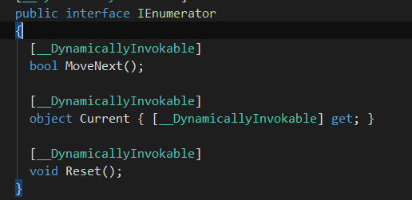
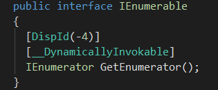

# GameFramework笔记-C#

## partial关键字
**partial**关键字用于修饰局部类，其中一个继承MonoBehaviour，别的局部类中都能使用MonoBehaviour的生命周期方法

## csc命令生成类库
### 配置环境变量
将c:\WINDOWS\Microsoft.NET\Framework\vX.X 配置到环境变量中
### 生成dll的命令
（1）当前文件夹下 `csc /target:library Person.cs`，用于生成dll
（2）`csc Program.cs ` 默认用于生成exe文件
（3）依赖别的类库进行打包成dll:
`csc -r:E:\SoftWareInstall\UnityInstall\Unity2018\Unity\Editor\Data\Managed/UnityEngine.dll -target:library MyDebug.cs;`

## 程序集用法
### 获取指定程序集指定类的所有子类
1. 加载程序集
`Assembly temAssembly=Assembly.Load(assemName)`
2. 获取指定程序集下的所有类型
`Type[]= temAssembly.GetTypes();`
3. 根据给定的type进行判断
- ` type.IsClass()`:是否是类
- ` typeBase.IsAssignableFrom(type)`:type是否继承(或间接继承)或实现类/接口
- ` type.IsSubClassOf(typeBase) `:type是否是base的子类
- ` type.FullName`: 当前指定type的类名
### 使用Activator动态创建类实例
1. 根据指定的程序集(不需要.dll后缀)和类型字符串 
`ObjectHandle h=Activator.CreateInstance("UnityGameFramework.Runtime","Son1"), TargetClass=h.Unwrap() as TargetClass;`
2. 通过该方法创建管理器对象，会执行对应的构造函数，但是不会触发断点

## 操作符'?'用法
### 可空类型修饰符:?
一般用于值类型变量声明时，如:int ? a，使得值类型变量也可为空。本质是编译器编译时把T?编译成System.Nullable的形式
### 三元运算符:?:
### 空合并运算符:??
1. 用于定义可空类型和引用类型的默认值。如a??b,如果a!=null，则返回a，否则返回b。
2. 为右结合运算符，即a??b??c，可看作a??(b??c)
### 调用运算符:?.
  对象调用方法时，如果对象为空则不调用。如:obj?.Method()

## IEnumerable和IEnumerator的用法
### IEnumerator和IEnumerable的关系
1. IEnumerator成员

2. IEnumerable成员

### 支持foreach遍历的两种方法：
1.实现系统接口：让这个类实现IEnumerable接口，并返回实现了IEnumerator接口的类的实例
2. 自定义：目标类需要有自定义的public权限的GetEnumerator()、MoveNext()方法，和Current的属性
### 延迟加载
IEnumerable是延迟加载的，每次访问(tolist())才取值

## 委托与事件
### 委托种类
1. Action委托:定义的是返回值为空的委托
2. Function:定义一个带返回值的委托
### 委托与事件的区别
1. 委托可根据权限进行赋值和调用，
2. 事件能根据权限进行注册和解绑，只能在所属类中调用
3. 事件如果改成属性访问器样式 event Myevent{add;remove}，则只能+=或-=，无论在哪
都不能直接执行，只能执行事件对应的私有委托
4. 规范化要求:事件对应的私有委托一般使用EventHandler<T>

## 枚举位运算(二进制)
1. 枚举类型加上[Flags]特性，表示该枚举支持位运算，其内元素最好按照2的n次方递增
2. '|'表示权限相与，a&(~b)表示权限相减
3. 枚举减法只能减有对应位的，不能随意减

## 字典与List的用法
### 字典
1. 按照key的值:dir[n]=value 相当于Add(n,value),n是key
2. 根据下标: dir.ElementAt(n).n是下标，key/value是只读的，无法修改 想修改指定下标的值可以
dir[dir.ElementAt(n).key]
3. 深拷贝与浅拷贝
 - 深拷贝 开辟空间并拷贝原来的值，比较地址返回false
 - 浅拷贝 不开辟空间 只是新建一个指向原地址的引用,直接用"=="比较字典名(本质是地址) 返回true
### List
 1.mylist[i]:i是下标，等同于ElementAt(i)
### 使用Linq排序
按照value的level属性进行降序排列并再返回一个字典
`dict=dict.OrderByDescending(item => item.Value.level).ToDictionary(p => p.Key, o => o.Value);`

## 特性
### 基础定义
给指定的某一声明的一则附加的声明性信息对程序中的元素进行标注，如类型、字段、方法、属性等。.net角度看特性是一种类，这些类继承于System.Attribute类，主要用在反射中；从面向对象级别看，是类型级别的。
### 作用
1. 运行时描述代码，或者影响程序的行为
2. 处理序列化、程序安全特性等
### 内置特性
注:特性类在编译的时候实例化，而不是通常那样运行时实例化
①Conditional:条件编译，满足条件才允许编译器对代码进行编译，一般用于程序调试
②DllImport:标记非.net函数，即在外部DLL中定义
③Obsolete:标记当前方法被废弃

## MemorySteam详解
1. Flush()函数
使用流写文件时，数据流会先进入到缓冲区中，而不会立刻写入文件，当执行这个方法后，缓冲区
的数据流会立即注入基础流，此方法确保首先将数据刷新至基础流然后再将其写入文件
2. Length:表示流中实际数据的长度(也可能是通过SetLength()设置数据长度方法修改)
3. Position:流中当前索引的位置，受很多因素影响：读写会等于实际数据的最新位置也可以Seek()直接设定强制改变当前索引；SetLength()如果长度小于当前数据的实际长度也会改变，且此时会有dirty_bytes，大于不会改变
4.  SetLength():修改流中实际数据的长度
- SetLength()不能超过Capacity否则报错
- SetLength()如果长度小于当前数据的实际长度会改变position，且此时会有dirty_bytes，大于不会修改position，只会修改Length
5. Capacity:当前缓冲区大小，只能通过构造函数或者Capacity属性赋值
6. GetBuffer():返回当前内存流整个缓冲区的数据，包括那些分配了但是并没有用到的字节数据
7. Close()关闭流并释放资源

## this的4种用法
1. 当前类的实例
2. 串联构造函数 public A():this(name) 先执行A(name) 后执行A()
3. 为指定的原始类型扩展方法
4. 索引器:通过索引值获取数据
一般格式：T this[int/string]{get{return ..}}

## lambda表达式捕获外部变量
### 问题
for循环遍历数组 无法在lambda直接使用循环变量(值为最大值+1(比如数组长度+1) 超出范围)
### 两种解决办法
1. 用个外部临时变量过度一下 如:int index=i(i是循环变量)
2. 用foreach lambda表达式可以直接使用循环变量

## 内存管理
1. 两种资源:托管资源和非托管资源([内存管理介绍](https://www.cnblogs.com/cjm123/p/8391823.html))
- 托管资源:该资源的回收人工无法干预，大多数对象都是托管资源，即可以依靠.NetFramework的垃圾回收器隐式地执行所有必要的内存管理任务
- 非托管资源:包括Stream流、数据库的连接、GDI+、Com对象等资源，需要我们手动去释放，否则会占用系统的内存和资源，可能出错。常见的有:FS,Stream,Socket,Write,Timer,Context等
2. Net提供Object.Finalize()允许垃圾回收器回收该对象时适当清理其非托管资源，实现Finalize()方法会对性能有影响，即需要两次垃圾回收 一次回收含终结器的 一次回收不含的
3. Windows的内存管理(虚拟寻址系统)
- 堆栈/栈:存放值类型，后入先出，性能高，不灵活，数据一般小
- 托管堆/堆:`Customer customer=new Customer() `在堆上分配一个内存，存放Customer实例，然后把该内存的地址设置为变量customer的值，customer分配在栈中
4. 非托管对象的特殊处理
对于不受垃圾回收期控制的指定专门的规则，使用两种机制自动释放该资源
- 声明析构函数(自动生成Finalize()):垃圾回收器删除对象时调用，受垃圾回收器运行规则决定，不能在析构中放需要在某时刻运行的代码，如果对象占用宝贵资源，应该尽快释放而不是等待回收器
- 实现IDisposable接口(替代析构函数):为释放非托管资源提供了确定的机制，同时避免了产生析构函数与垃圾回收器可能造成的问题。调用Dispose()时可能出异常，一般方法用try{}finally{}捕获异常并确保关闭，为了防止重复这样的结构，C#提供了using(){}代码块确保引用在超出作用域时即使有异常，对象也会自动调用Dispose()(不是Close())
5. Object.Finalize(终结器)
默认不执行任何操作，用于释放非托管资源。如果想让垃圾回收器回收对象的内存之前对对象执行清理操作，必须重写该方法。有两种重写方法
①析构函数 ②对基类的Finalize的调用。
注意:不建议使用该方法，因为回收对象内存时至少需要两次垃圾回收，只回收没终结器的
6. SuppressFinalize()方法则告诉垃圾收集器有一个类不再需要调用其析构函数了，就意味着垃圾收集器认为这个对象根本没有析构函数。一般该方法在IDisposable.Dispose()中调用。

## AppDomain详解
### 与CLR的关系
AppDomain是CLR的运行单元，CLR被CLRHOST加载后 会创建默认的AppDomain且程序的入口点Main()就是在这个默认的AppDomain中执行
### 与进程的关系
 AppDomain被创建在进程中，一个进程可多个AD,一个AD只能一个进程
### vs线程
AppDomain是静态概念，只限定了对象的边界；线程是动态概念，可运行在不同的AD,一个AD可创建多个线程，但不能限定线程只在本AD中执行。该线程其实是ST，不能被操作系统识别，操作系统识别的是HT，当ht访问到某个AD时，AD就会为之产生一个ST，ht有thread local storage(TLS)，这个存储区被CLR用来存储这个ht当前对应的AD引用以及st引用，ht穿越到另一个AD时，TLS中的这些引用也会变。
### vs Assembly
Assembly是.Net的基本部署单元，为CLR提供元数据，不能单独执行，必须得被加载到AppDomain中，然后由AppDomain创建程序集中的对象，一个程序集可被多个AD加载，一个AD可加载多个程序集。每个AppDomain引用到某个类型的时候需要把相应的assembly在各自的AppDomain中初始化。因此，每个AppDomain会单独保持一个类的静态变量。

## 接口与抽象类
1. 接口中可以包含方法和属性(普通属性访问器或者事件)，不可以包含字段
2. 一个类同时继承了抽象类以及实现了接口，抽象类中的抽象成员必须被override，**如果抽象类和接口含有相同签名的成员，则该类中只需要包含一个重写成员即可**

## 反射
1. 泛型类型的创建
- `type.MakeGenericType(params Type[] types) `根据指定目标泛型类的类型和类型参数types 返回表示结果构造类型的 Type 对象。
- `ObjectPoolBase objectPool = (ObjectPoolBase)Activator.CreateInstance(objectPoolType, name, allowMultiSpawn, autoReleaseInterval, capacity, expireTime, priority)` Activator.CreateInstance(targetType,目标类型构造函数所需参数(可省略))