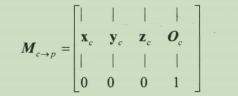
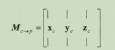
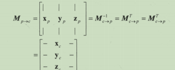
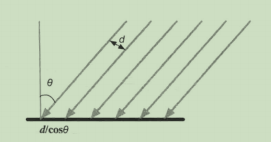
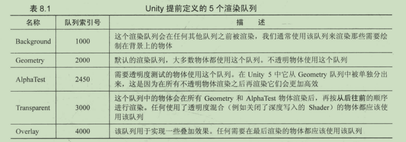
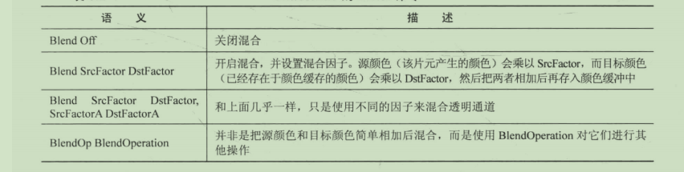

# 第4章 
## 4.6坐标空间的变换
1. 已知子坐标空间C的3个坐标轴在父坐标空间P下的表示Xc、Yc、Zc，以及其原点位置Oc。给定子坐标空间的点Ac=(a,b,c)，求Mc->p如下：

2. 对方向矢量进行坐标空间变换可以使用3X3的矩阵表示:
3. 如果变换矩阵**是正交矩阵，则其逆矩阵=转置矩阵**（如果一个变换只存在平移和旋转，那么其逆矩阵=转置矩阵），则逆矩阵Mp->c如下：

## 4.7 法线变换

1. 法线不能直接使用和顶点相同的变换矩阵，需要特殊的变换矩阵
2. 经过推导，法线的变换矩阵为顶点矩阵的逆转置矩阵

# 第6章 Unity中的基础光照

## 6.1 光源
### 6.1.1 光源简介
l:光源方向 n:表面法线 a:n和l的夹角
1. **辐照度**：对于平行光来说，辐照度可通过计算在垂直于l(光源方向)的单位面积
上单位时间内穿过的能力来得到。
2. 辐照度是和照射到物体表面时光线之间的距离d/cos a成反比的，即辐照度与cos a成正比。而cos a可以用l.n来得到  

### 6.1.2 吸收和散射
1. 光源与物体相交产生的结果只有两个:散射、吸收
2. **散射**分为:
* 折射/投射：散射到物体内部
* 反射：散射到物体外部
3. **高光反射(specular)**：表示物体表面是如何反射光线的
4. **漫反射(diffuse)**：表示有多少光线会被折射、吸收和散射出表面
5. **出射度(exitance)**：根据入射光线的数量和方向，计算出射光线的数量和方向。辐照度和出射度之间满足线性关系，他们之间的比值就是**材质的漫反射和高光反射属性**
### 6.1.3 着色
1. **着色**：根据材质属性（漫反射属性等）、光源信息（方向、辐照度），使用一个等式去计算沿着某个观察方向的出射度的过程。这个等式就是**光照模型（Lighting Model）**
### 6.1.4 BRDF光照模型
1. BRDF（Bidirectional Reflectance Distribution Function）用于当光线从某个方向照射到一个表面时，计算有多少光线被反射？反射的方向有哪些。
## 6.2 标准光照模型
1. 概念
* 由裴祥风提出的只关心直接光照的模型，也被成为Phong光照模型。
* 组成部分：
    * 自发光(emmisive) 模拟直接进入摄像机的部分光源。等式如下：**C emmissive=M emissive**
    * 高光反射(specular) 
        1. 计算高光反射所需的信息较多，如:n、v、l、**r(反射方向)**。反射方向可通过其他信息得到：**r=2(n.l)n-l**
        2. **Phong模型**  
        **C specular=(C light.M specular)max(0,v.r)^M gloss**。其中,M gloss是材质的光泽度/反光度。它用于控制高光区域的亮点有多宽，M gloss越大，亮点越小。M spcular是材质的高光反射颜色。
        3. **Blinn模型**（不需要计算反射）  
        也被称为Blinn-Phong光照模型。引用新矢量h，**h=(v+l)/(|v+l|)**，光照模型公式如下：**C spcular=(C light.M specular)max(0,n.h)^M gloss**
        4. 两者区别：  
        如果摄像机和光源距离模型足够远，则Blinn会快于Phong模型，因为此时可以认为v、l是定值，则h是常量。但v、l不是定值时，Phong会更快一些。
    * 漫反射(diffuse) 
         1. 用于被表面随机散射到各个方向的辐射度进行建模。视角位置不重要，因为在任何反射方向上分布都是一样，但是入射光线的角度很重要。
         2. 漫反射符合**兰伯特定律（Lambert's law）**：反射光线的强度与cos a成正比。计算公式如下：**C diffuse=(C light.M diffuse)max(0,n.l)**
    * 环境光(ambient) 模拟间接光照，是一个全局变量，即所有物体都使用这个环境光。等式如下: **C ambient=g ambient**
### 6.2.1 逐像素或逐顶点
1. 计算所在位置
* 逐像素光照：在片元着色器中计算光照模型
* 逐顶点光照：在顶点着色器中计算
2. 计算法线
* Phong着色：在逐像素光照中，在面片之间的对顶点法线进行插值的技术。
* 高洛德着色：顶点光照中，对顶点法线进行插值的技术。
3. 区别
* 顶点数目远小于像素，因为逐顶点光照计算量远小于逐像素光照
* 逐顶点光照依赖于**线性插值**，因此如果光照模型中有非线性的计算时，逐顶点光照就会有问题：渲染图元内部对顶点颜色进行插值，导致图元内的颜色总是暗于顶点出最高颜色值，某些情况会产生棱角现象。
## 6.3 实现漫反射光照模型
注:为了防止点积结果为负，除了使用max(0,x)截取外，还可以使用saturate(x)会把x截取到[0,1]范围内，如果x是矢量，会对其每个分量进行这样的操作
### 6.3.1 半兰伯特光照模型
1. 如果使用原兰伯特光照模型，背光面点积结果全被映射到0值处。则看不出明暗变化，像个平面一样。
2. 半兰伯特光照模型公式如下:C diffuse=(C light.M diffuse)(a(n.l)+p)。a和p一般默认为0.5
## 6.4 使用Unity内置函数或变量
*想使用下面的函数，应引入内置文件lighting.cginc*

1. 函数

   * 法线转换函数o->w：**UnityObjectToWorldNormal**(normal)

   * 观察方向o->w: **WorldSpaceViewDir()/UnityWorldSpaceViewDir()/ObjSpaceViewDir()**
     输入模型返回世界空间的观察方向/输入世界空间坐标，返回世界空间观察/输入模型返回模型
   * 光照方向o->w：**WorldSpaceLightDir()/UnityWorldSpaceLightDir()/ObjSpaceLightDir()**同2
   * 方向矢量o->w： **UnityObjectToWorldDir()**，w->o：UnityWorldToObjectDir()

2. 变量

   * `UNITY_LIGHTMODEL_AMBIENT` 获取环境光

   * `_LightColor0` 获取光照颜色（需要设置正确的标签 "LightMode"）

   * `_WorldSpaceCameraPos` 世界空间相机坐标

   * `_WorldSpaceLightPos0` 获取光源方向l，来计算光源方向(只适用于单个平行光)。点指向光源

   * `unity_WorldToObject`  从世界空间到模型空间的内置变换矩阵，（原为:`_World2Object`）
   
     

# 第7章 基础纹理
*注意：*
1. 语义区分大小写，大小写不对会导致严重错误。
## 7.1 概念
1. **纹理映射技术**：使用纹理映射技术，把图黏在模型表面，**逐纹素**地控制模型的颜色。
2. **纹理映射坐标**：建模时，通常利用纹理展开技术把纹理映射坐标存储在每个顶点上。定义该顶点在纹理中对应的2D坐标。使用二维变量(u,v)来表示。因此纹理映射坐标也被称为**uv坐标**。一般会被归一化到[0,1]范围内。
3. 纹理的两种模型
* Wrap Mode:平铺模式，有Repeat、Clamp两种。Repeat是忽略整数部分，直接使用小数部分进行采样，得到的结果是纹理将不断重复；Clamp模式下，如果uv>1那么会截取到1，uv<0会截取到0。
* Filter Mode:滤波模式，有Point,Bilinear以及Trilinear三种。得到的效果依次提升，耗费性能也增大。纹理缩放更复杂，最常用的方法是**多级渐远纹理技术**，形成一个图像金字塔，空间换时间，通常多占用33%的内存。纹理导入面板勾选**Generate Mip Maps**即可开启多级渐远纹理
    * **Point模式** 使用最近邻滤波，放大或缩小时，采样的像素只有一个，因此图像看起来有**像素风格**，然后对它们进行线性插值混合后得到最终像素。
    * **Bilinear模式**  使用线性滤波，对于每个目标像素找附近4个邻近像素线性插值后得到最终像素，因此图像**看起来模糊**了。通常选择该模式
    * **Trilinear模式** 和Bilinear几乎一样，只是还会在多级渐远纹理之间进行混合。如果纹理没有使用多级渐远，则两者相同。
4. 内置函数
* `uv=TRANSFORM_TEX(texcoord,_MainTex)` 获取纹理坐标
## 7.2  凹凸映射
1. 两种进行凹凸映射的方法：
* 高度纹理/高度映射：存储强度值（intensity）,表示表面海拔，颜色越深越凹，越浅越高
* 法线纹理：存储表面的法线方向。由于法线范围[-1,1],像素范围[0,1],因此将法线映射到纹理像素到公式为：**pixel=(normal+1)/2**，反之，纹理采样时，像素到法线到映射公式为：**normal=pixel*2-1**。法线纹理又分为两种
    * 模式空间的法线纹理：存储模型空间的**绝对法线信息**。优点：1.简单直观，计算量更少。2.尖锐处，突变较少，即可提供平滑边界。
    * 切线空间的法线纹理(右手坐标系)：存储切线空间的**相对法线信息**，切线空间原点为顶点，x:切线，z:法线，y：z叉乘x又叫副切线或副法线。优点：1.自由度很高，记录相对法线信息，即即便把该纹理应用到完全不同的网格，也能得到合理的结果。2.可进行uv动画。3.可重用法线纹理。4.可压缩，即可省略z，只存储xy，通过xy推导z。模型空间的纹理不行。
2. 法线纹理类型一般选择**Normal Map***

   * **想要获取法线纹理对应的法线，不能通过反映射公式，需要通过**3=UnpackNormal(4)**函数。如果没设置类型，则需要自己手动反映射。

   * 设置 `NormalMap`可以让Unity根据不同平台对纹理进行压缩
## 7.3 渐变纹理(控制漫反射)
1. 渐变纹理一般是**横向一维纹理**，因此纹理采样时y和x一致即可。一般渐变纹理的wrapMode模式需要设置为**clamp**，防止对纹理进行采样时由于浮点数精度造成的问题。
2. 渐变纹理漫反射计算方法
   * 计算halfLambert模型
   * 采样渐变纹理：**tex2D(_RampTex,fixed2(halfLambert,halfLambert))**
   * 漫反射结果`diffuse=_Color.rgb * tex2D(_RampTex,fixed2(halfLambert,halfLambert)).rgb`
3. fixed4=tex2D(tex,uv)
## 7.4 遮罩纹理(mask texture)
*注意：顶点着色器能使用的插值寄存器是有限的，一般遮罩纹理是指高光反射遮罩。*
1. 前提：之前的实现，都是把高光反射应用到模型表面的所有地方，即所有像素都使用同样大小的高光强度和高光指数。有时希望模型某些区域反光强烈，某些区域弱一些。因此使用一张遮罩纹理来控制光照。使用其中**某个/某几个通道值**与某种表面属性进行相乘，**当该通道为0时，可保证模型表面不受该属性影响**。使美术人员更精准的控制模型表面的各种性质。
2. 如果同时定义了多个纹理，我们可以只定义一个纹理属性变量_ST。这意味着，在材质面板中修改主纹理的ST会同时影响这多个纹理的采样。使用这种方式可以**节省需要存储的纹理坐标数目**，前提是这些纹理不需要进行平铺和位移操作，或者使用同一种平铺和位移。如果每个纹理都单独使用一个属性变量_ST，随着使用的纹理数目的增加，会迅速**占满顶点着色器中可以使用的插值寄存器**。
3. 遮罩纹理只需要占用纹理的一个分量，将该分量和高光反射部分进行相乘。为了充分利用，可以使用每个颜色通道来存储不同的表面属性，如：高光反射强度存储在R通道，边缘光照强度存储在G通道，自发光存储在A通道，高光反射指数存储在B通道。
# 第8章 透明效果
## 8.1 概念
1. Unity中，有两种方法实现透明效果
* 透明度测试(Alpha Test)  没关闭深度写入。与其他不透明物体相比唯一的区别是会根据透明度进行判断是否显示该片元。不能得到真正的半透明效果。
* 透明度混合(Alpha Blending)
    * 深度缓冲是只读的
    * **关闭深度写入** 
      * 原因：*不关闭深度写入的话，一个半透表面背后的表面，本来可以看到，但由于深度测试判断后面的表面更远需要被剔除，我们就无法看到背后的表面了。*
      * 后果：破坏了深度缓冲的工作机制，导致渲染顺序变得非常重要
    * 先进行深度测试，满足条件则使用当前片元的透明度与颜色缓冲区的值进行混合，不满足则不进行混合。
2. 渲染顺序的问题
* 先渲染所有的不透明物体，并**开启他们的深度测试和深度写入**
* 再把半透明物体按他们距离摄像机的远近进行排序，从后往前渲染，开启深度测试，**关闭深度写入**
* 也会遇到循环重叠的半透明物体以及覆盖一半的情况。

3. 渲染队列(render queue)
* 使用SubShader的**Queue标签**决定将我们的模型归于哪个渲染队列，**Unity内部使用整数索引表示每个渲染队列，索引号越小越早被渲染。**
* Unity提前定义的5个渲染队列如下:

4. 常用函数及标签
* `void clip(f4/3/2/1)` 片元着色器中使用进行**透明度测试函数**。如果参数的任何一个分了是负数，就会舍弃当前像素的颜色
* 几种常用标签
    * `Queue=AlphaTest/Transparent` 渲染队列标签  透明度测试/透明度混合需要指定队列为Transparent
    * `RenderType`=`TransparentCutout/Transparent` 让Unity把这个Shader归入到提前定义的组(TransparentCutout/Transparent) 中，以指明该Shader是一个使用了透明度测试/混合的Shader，常被用于着色器替换功能
    * `IgnoreProjector`=`True` 设置为True意味着这个Shader不会受到投影器Projectores的影响  
*注：1.通常透明度测试/混合会包含上述三种标签，且位置是在SubShader中  
2.多个标签之间 用空格隔开*
## 8.4 透明度混合
1. 透明度混合：使用**当前片元的透明度**作为混合因子，与已经存储在颜色缓冲区的颜色值进行混合，得到新颜色。**透明度混合需要关闭深度写入，因此需要小心物体的渲染顺序**。
2. 想要实现半透效果就需要把当前颜色和颜色缓冲区的颜色进行混合，需要使用混合命令**Blend**，混合使用的函数由该指令决定，本书使用下图第二种语义（不仅设置混合因子，还自动开启混合模式）。使用该语义新的颜色计算公式如下：**DstColor new=SrcAlphaXSrcColor+(1-SrcAlpha)XDstColor old**
3. 如果网格具有复杂的遮挡关系或者非凸网格时，**关闭深度写入的透明度混合会产生错误的透明效果**

## 8.5 开启深度写入的透明度混合

1. 方法：使用两个Pass渲染模型，第一个Pass开启深度写入，但不输出颜色，仅仅是为了把深度值逐像素的写入深度缓冲中。第二个Pass根据上个Pass刷新的深度缓冲区，按照逐像素的深度信息进行正常的透明度混合并输出颜色。
2. `ColorMask` 渲染命令，语义: `ColorMask RGB|A|0|其他任意RGBA的组合` 用于设置颜色通道的写掩码，设置为0时，表示该Pass不写入任何颜色通道，即不输出任何颜色。

## 8.6 ShaderLab混合命令

1. **混合等式**：根据源颜色S(片元的颜色)和目标颜色D(颜色缓冲区的颜色)得到输出颜色O使用的等式。
   * 进行混合时，需要使用两个等式，需要4个因子，一个用于混合RGB通道，一个用于混合A通道
   * 设置的是等式中的**操作**和**因子**
   * 默认都是加操作 通过 `BlendOp Add/Sub/Min/Max` 修改混合操作

## 8.7 双面渲染的透明效果

1. 对于透明度测试来说，想得到双面渲染的效果，只需要关闭剔除 `Cull Off`即可。默认为 `Cull Back`
2. 对于透明度混合来说，由于关闭了深度写入，则直接关闭剔除是无用的。可以通过使用两个Pass的方法，第一个Pass `Cull Front` 剔除前面渲染背面，第二个Pass剔除后面渲染前面，渲染代码一直，由于Pass是按照顺序执行，则可以保证背面总是在正面之前被渲染

# 第9章更复杂的光照

## 9.1 Unity的渲染路径

1. 概念

   * **渲染路径**：决定光照是如何应用到Unity Shader中的。和光源打交道，需要为每个Pass指定它使用的渲染路径，这样Shader的光照计算才能正确执行。

   * **渲染路径类型** 5.0之前有以下三种：

     * 前向渲染(Forward)
     * 延迟渲染路径(Deferred) 5.0以后被新的延迟渲染替换，但仍兼容Legacy
     * 顶点照明渲染路径(Vertex Lit)  5.0以后被抛弃 但仍兼容Legacy

   * `LightMode`标签支持的渲染路径设置

     

   * 如果当前显卡不支持选用的渲染路径，会自动使用更低一级的渲染路径，如不支持Deferred则自动使用Forward。

### 9.1.1前向渲染路径

1. 前向渲染原理
   * 需要渲染当前对象的图元，并计算C Buffer和Z Buffer。且进行深度测试判断片元是否课件
   * 每个**逐像素光源**，都要执行一次上面的Pass流程。则如果N个物体，受M个光源影响，则一共需要N*M个Pass，即要执行的Pass数据会很大。因此， **渲染引擎通常会限制每个物体的逐像素光照数目**

2. Unity的前向渲染
   * 前向渲染的3种处理光照的方式：逐顶点、逐像素、球谐函数(SH)处理。决定处理模式的是光源的类型（平行、点、聚光灯）和渲染模式（是否Important）
     * 最亮的平行光是逐像素
     * 渲染模式标记成Important按照逐像素，否则逐顶点或者SH
     * 上述得到的逐像素小于Quality Setting里的 `Pixel Light Count`时，会有更多光源以逐像素方式进行渲染。
   * “BasePass”和AddPass的区别
     * 分别制定不同的编译指令 `#pragma multi_compile_fwdbase/fwdadd`，只有设置了相应的编译指令，才能得到正确的光照变量，如光照衰减值
     * BasePass中可以访问  `Lightmap`、环境光、自发光。只会执行一次，因此把环境光自发光在此计算。渲染的平行光是默认有阴影的。计算的光照包括一个逐像素+其他所有逐顶点和SH
     * AddPass渲染的光源默认没有阴影效果，即使设置了光源的 `Shadow Type` 。可以修改编译指令为 `.._fwdadd_fullshadows`  为聚光灯和点光源开启阴影。
     * AddPass 开启了混合，因为需要将多个光源的效果叠加，混合模式是`Blend One One`
     * 对于前向渲染，一个Shader通常定义一个BasePass(双面渲染时可以定义两个)和一个AddPass
   * 渲染路径的设置用于告诉Unity该Pass在前向渲染中的位置，然后引擎会计算并填充内置变量
3. **如果场景没有任何平行光，Base Pass会被当成全黑的光源处理。即Base Pass处理的逐像素光源类型一定是平行光，且通过 `_WorldSpaceLightPos0`、`_LightColor0` **等内置变量获取方向和颜色

### 9.1.2 顶点照明渲染路径

1. 概念
   * 配置要求最低，性能最高，效果最差
   * 相当于前向渲染的子集。只进行逐顶点计算。
   * 5.0版本被投票去掉

### 9.1.3 延迟渲染路径

1. 前提
   * 前向渲染的问题：当场景包含大量实时光源时，性能急速下降。本质是需要为每个物体都执行多个pass来计算光源对该物体的光照结果，然后把结果混合起来得到最终的光照，**每执行一个Pass都需要重新渲染一遍物体，很多计算实际上是重复的**
   * 延迟渲染会利用额外的**缓冲区-G Buffer**，存储表面的其他信息（法线、材质属性、位置等）

2. 原理
   * 两个Pass（跟光源数目无关）
     * 第一个Pass 只根据深度测试计算片元的可见性，然后写入G Buffer。不计算任何光照
     * 第二个Pass 利用G Buffer的各个片元的信息，如法线、视角等进行真正的光照计算。效率不依赖于场景复杂度，跟我们屏幕大小有关，可以将缓冲区看成一张张2D图像。

3. Unity中的延迟渲染

   * 两种延迟渲染路径：一种是5.0之前使用的`Legacy Deferred`；另一种是5.0以后使用的 `Deferred`。旧版不支持5.0中的基于物理的 `Standard Shader`

   * 适用情况：场景光源数据很多，前向渲染会造成性能瓶颈的时候
   * 缺点：
     *  不支持真正的抗锯齿功能
     * 不能处理半透明物体
     * 对显卡有一定要求，必须支持MRT、Shader Mode 3.0及以上、深度渲染纹理以及双面模板缓冲
   * G缓冲包含以下几个渲染纹理(RT)
     * RT0:ARGB32，存储漫反射，A通道没被使用
     * RT1:ARGB32，存储高光反射，A通道存储高光反射指数部分
     * RT2:ARGB2101010，RGB通道用于存储法线，A通道没有被使用。
     * RT3:ARGB32，存储自发光+lightmap+反射探针
     * 深度缓冲、模板缓冲

## 9.2 光源类型

1. 光源的属性（**位置、方向、颜色、强度、衰减**）与光源的集合定义息息相关
2. 光源类型
   * 平行光：只有方向，没有位置，也就没有衰减的概念，即衰减始终为1
   * 点光源 ：是球体几何，有位置概念，也就有衰减因素
   * 聚光灯：一块锥形区域定义，同上

3. Unity处理点光源的顺序是按照他们的重要度排序。影响排序的因素有**距离、强度、颜色**三个因素。如果物体不在光源范围内，则不会触发渲染事件。
4. 光照衰减
   * **纹理作为衰减查找表**的优缺点
     * 优点：避免了数学公式复杂的计算，提升性能。Unity默认使用这种方式计算逐像素的点光源和聚光灯的衰减
     * 缺点：需要预处理得到纹理，而且纹理大小会影响衰减精度；不直观不方便，无法使用其他数学公式
   * 内置变量
     * `_LightTexture0` 代表衰减查找表的纹理，通常只关心对角线上的纹理颜色，且通过距离的平方进行采样，避免开方操作。如果开启了cookie ，则纹理变量为 `_LightTextureB0`。
     * `unity_WorldToLight` 从世界到光源空间的变换矩阵。 需要导入内置文件 `AutoLight.cginc`
     * `UNITY_ATTEN_CHANNEL` 宏 得到衰减纹理中衰减值所在的分量。
   * 数学公式计算衰减（线性）
     * `atten=1.0/lenght(_WorldSpacePos0.xyz-i.worldPosition.xyz)`
     * 效果不太好

## 9.4 Unity的阴影

1. "Shadow Map"阴影映射纹理技术：实时渲染中，将摄像机位置放在光源重合的位置上，摄像机看不到的地方就是光源的阴影区域。该纹理**本质就是一张深度图**，记录**从光源出发**，能看到的场景中距离他最近的深度信息。

2. Shadow Map的计算：使用额外的Pass（"LightMode 被设置为"ShadowCaster"）来专门更新该纹理，而不是add pass或base pass（浪费性能）。该Pass的渲染目标不是帧缓冲，而且阴影纹理。
   *  过程：Unity将相机放在光源位置上，调用这种Pass，且将顶点转换到光源空间，然后输出顶点的深度信息到阴影纹理中。
   * 处理的Pass：如果当前物体的Shader不存在类型为ShadowCaster的pass，则在Fallback指定的Shader查找，如果还没有，就无法向其他的物体投射阴影。仍然可以接受阴影。
   * 采样的两种方式
     * 传统是在普通pass中将顶点变换到光源空间，然后xy分量采样阴影纹理得到阴影深度z。判断顶点z是否大于阴影深度z，是则有阴影。
     * **屏幕空间的阴影映射技术**：原是延迟渲染产生阴影的技术，不是所有的平台都使用该技术，因为需要显卡支持MRT。
   * 屏幕空间的阴影映射技术的流程：使用阴影pass得到**光源的阴影映射纹理和相机的深度纹理**，然后根据这两者得到阴影图。如果相机深度图记录的表面深度大于阴影纹理的深度值，说明该点在阴影中。如果我们想要接受阴影，只需要对阴影图进行采样。
   * 
   * 总结：接受阴影和投射阴影不同
     * 接受阴影，即该物体对阴影图进行采样，把最后的光照结果和采样结果相乘产生阴影。通过**宏定义三剑客**接受，使用三剑客时需要注意，a2v的顶点名必须是vertex，v2f的顶点必须是pos。
     * 投射阴影，必须把该物体加入到光源的阴影映射纹理中，这样其他物体在采样阴影纹理时会得到相关信息。通过阴影Pass来实现。

3. 不透明物体的阴影
   * 设置`MeshRenderer`的Cast Shadows（如果是单面物体 有事需要设置为Two Sided）和Receive Shadows 。
4. 内置变量

* `SHADOW_COORDS` 宏定义 声明采样阴影纹理的坐标 参数是下一个可用的插值寄存器(TEXCOORDn)的索引。
* `TRANSFER_SHADOW(v2f)` 用在vert函数中，用于填充采样阴影纹理坐标。
* `SHADOW_ATTENUATIOn(v2f)` 用在 frag函数中，用于采样阴影纹理
* `UNITY_LIGHT_ATTENUATION` 内置宏 用于计算光照衰减和阴影 参数("atten",v2f,worldPos)，这样basspass和addpass 就不用分别再计算阴影和光照了  同时使用该宏即可，区别是前者需要计算环境光。

# 第10章 高级纹理

## 10.1 立方体纹理

1. 概念

   * **立方体纹理**是**环境映射**的一种实现方法。环境映射可以模拟物体周围的环境，而使用环境映射的物体看起来像镀金属一样反射出周围的环境
   * 共包含6张图像，对应立方体的6个面。
   * 采样方法：采样需要使用三维纹理坐标，表示从立方体中心出发，向外部伸展与立方体的交点得到采样结果。
   * 优缺点
     * 简单快速，效果好
     * 引入新物体、光源，或物体移动时，我们需要重新生成立方体纹理；仅仅可以反射环境，不能反射使用该立方体纹理的物体本身，**因为立方体纹理不能模拟多次反射的结果**

2. 天空盒子

   * 纹理的 `Wrap Mode`需要设为 `Clamp`，防止接缝处出现不匹配

   * 代码生成立方体纹理（在向导编辑器 `ScriptableWizard` 中执行） ，格式是 ".cubemap"，需要勾选 `Readable` 否则无法动态渲染。

     ```c#
     	void OnWizardCreate () {
     		// create temporary camera for rendering
     		GameObject go = new GameObject( "CubemapCamera");
     		go.AddComponent<Camera>();
     		// place it on the object
     		go.transform.position = renderFromPosition.position;
     		// render into cubemap		
     		go.GetComponent<Camera>().RenderToCubemap(cubemap);//关键代码 根据当前相机 渲染指定的cubemap
     		
     		// destroy temporary camera
     		DestroyImmediate( go );
     	}
     ```

3. 反射
   * 立方体纹理的反射与高光反射的区别
     * 计算后者漫反射的公式是  "L r=reflect(-l,n)" ，即通过入射光和法线计算高光反射方向
     * 前者公式是 "ref=reflect(-v,n)" ，根据光路可逆的原则，由观察方向和法线，计算出反射方向的立方体纹理坐标（方向）。然后根据纹理坐标 直接对立方体纹理进行采样（无需归一化）即可。
     * 相关变量和函数
       * `texCUBE(_Cubemap,ref)` 根据坐标采样立方体纹理
       * `lerp(diffuse,reflection,_refScale)` 在漫反射和环境反射之前根据比例取值（_refScale决定的是后一个参数的占比）
   
4. 折射

   * **斯涅耳定律**计算反射角


		* 对于透明物体来说，更准备的模拟放射是进行两次折射：进入和射出。但我们通常仅模拟第一次折射
		* 最终颜色是 `ambient+lerp(diffuse,refraction,_refractAmount)*atten` 需要计算衰减、阴影
  * 内置函数
    * `refract(-v,n,入射光折射率/折射光介质的折射率)` 

5. 菲涅尔反射
   * 光线照射在物体表面，反射光和入射光之间存在一定比率关系。如湖面，脚边的水面是透明的（折射），远处只能看看到反射
   * 菲涅尔反射近似等式
   * 在顶点着色器中计算观察和反射方向，在片元中计算菲涅尔反射
   * 需要计算阴影和衰减

## 10.2 渲染纹理

1. 镜子效果（Render Texture）
   * 搭建：镜子的相机+render Texture(指定给镜子相机的Render Target)
   * Shader中，需要翻转纹理的x（x=1-x），因为镜子显示的图像都是左右相反的
2. 玻璃效果(Grab pass)
   * `GrabPass{"_RefractionTex"}` 通常用于渲染透明物体（队列需要是透明队列），定义该Pass后Unity会把当前屏幕图像绘制在文立中，以便我们在后续Pass中访问。 抓屏纹理对应两个CG变量，分别是 `_RefractionTex` 抓屏纹理和 `_RefractionTex_TexelSize`代表抓屏纹素大小（纹理分辨率的倒数）
   * 计算玻璃产生的折射。切线空间发现X折射度X纹素大小
   * 
   * 相关函数
     * `ComputeScreenPos` 计算屏幕坐标
     * `ComputeGrabScreenPos(clipPos)` 给定裁剪pos，返回对应的抓取的屏幕纹理的uv， 和上基本类似，最大不同是针对平台差异处理了采样坐标的问题
3. 渲染纹理与GrabPass比较
   * 步骤上来讲，后者简单
   * 效率上，前者好，尤其是移动设备
     * 前者可以通过控制相机渲染的层减少二次渲染场景大小
     * 后者抓屏的图像分辨率和屏幕一样，在高分辨率设备会造成严重的贷款影响。最主要的是，需要CPU直接读取back buffer中的数据，破坏了CPU和GPU的并行性。
4. 命令缓冲：Unity 5引入了命令缓冲允许我们扩展渲染流水线，使用它，也可以得到类似抓屏的效果，在不透明物体渲染后把当前图像复制到临时的渲染目标纹理，然后进行额外的操作，比如模糊。

# 第11章 动画

1. Unity Shader内置的时间变量。**动画效果往往都是把时间添加到一些变量的计算中**，让在时间变化时画面也变化。


## 纹理动画

1. 序列帧动画

   * 一般都是透明纹理，需要关闭深度写入、设置队列为透明、忽略投影

   * 本质算法（片元着色器中？）：

     * 先根据时间，算出当前对应的子图像的整数(floor)行列下标
     * 然后根据总行列数，对整个uv进行等分，得到子图形的纹理坐标范围
     * 根据当前行列下表，对自图形纹理坐标进行偏移。

   * 代码块如下

     ```hlsl
     			fixed4 frag(v2f i):SV_TARGET{
     				float time=floor(_Time.y*_Speed);//floor 返回<=x的最大整数 x的下层整数
     				float rowIndex=floor(time/_HorizontalCount);
     				float colIndex=time-rowIndex*_HorizontalCount;
     				float2 uv=float2(i.uv.x/_HorizontalCount,i.uv.y/_VerticalCount);//对整个uv按行列进行等分得到每个子图像的纹理坐标范围
     				// uv+=float2(rowIndex/_HorizontalCount,-colIndex/_VerticalCount);
     				uv.x+=colIndex/_HorizontalCount;//使用当前行列数对上面等分后的结果进行偏移
     				uv.y-=rowIndex/_VerticalCount;
     				fixed4 pixel=tex2D(_ImageSequence,uv);
     				pixel.rgb*=_Color;
     				return pixel;
     			}
     ```

2. 滚动纹理背景

   * 本质算法：对纹理进行缩放偏移计算后，加上随时间变化的偏移 （水平滚动只加x即可）

   * 代码块如下

     ```
     				//frac 返回参数的小数部分。因为只横向滚动 所以时间只作用在x
     				o.uv.xy=TRANSFORM_TEX(i.texcoord,_MainTex)+frac(float2(_Time.y*_ScrollSpeedX1,0));
     				o.uv.zw=TRANSFORM_TEX(i.texcoord,_DetailTex)+frac(float2(_Time.y*_ScrollSpeedX2,0));
     ```

## 顶点动画

1. 顶点动画注意事项
   * 需要使用 `DisableBatching=true` 标签来关闭当前物体的批处理
   * 原因：在使用顶点动画时，需要知道当前物体的模型空间（顶点动画是在模型空间下对顶点位置进行偏移）。如果进行批处理，会合并所有相关模型，则模型各自的模型空间就会丢失。
2. 河流波浪
   * 本质：使用三角函数搭配_Time修改模型空间坐标
   * 公式`m*sin(f*time+waveLength*(x+y+z))`
3. 广告牌（始终面对观众）
   * 根据视角旋转当前物体
   * 本质：构建旋转矩阵，3个基向量：表面法线n（不固定）、指向上的方向u（不固定）、向右的方向r，以及矩阵的远点锚点。模拟草丛时，则u固定，模拟粒子效果时，法线固定（始终面向观众）
   * 流程：先设定normalDir就是观察方向（因为要始终面向观众）。然后根据normalDir.y的绝对值获得不垂直的upDir是y轴还是z轴。然后得到rightDir，再反推UpDir。
4. 注意事项
   * 由于顶点动画关闭了批处理，所以有些耗费性能。常用的解决办法是：把顶点到锚点的距离填充到顶点颜色值上。
   * 顶点动画的物体，如果使用第9章的方式会得到错误的阴影效果。unity绘制阴影需要调用一个ShaderCaster，如果直接使用内置的SCPass，并没有阴影相关的计算，会按照原来的顶点位置计算阴影。因为我们需要自定义一个SC

